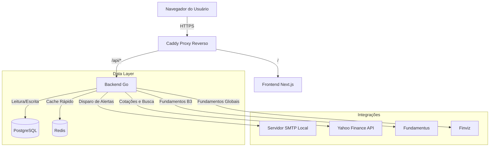
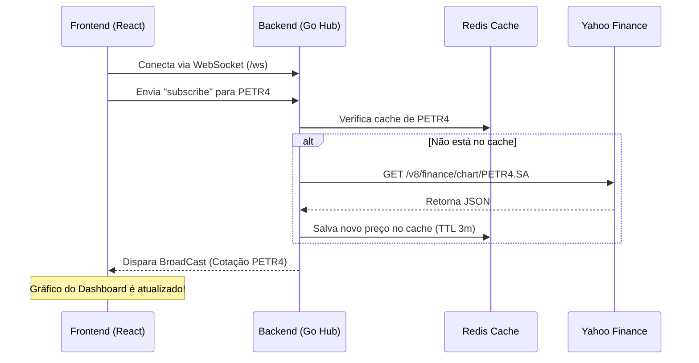
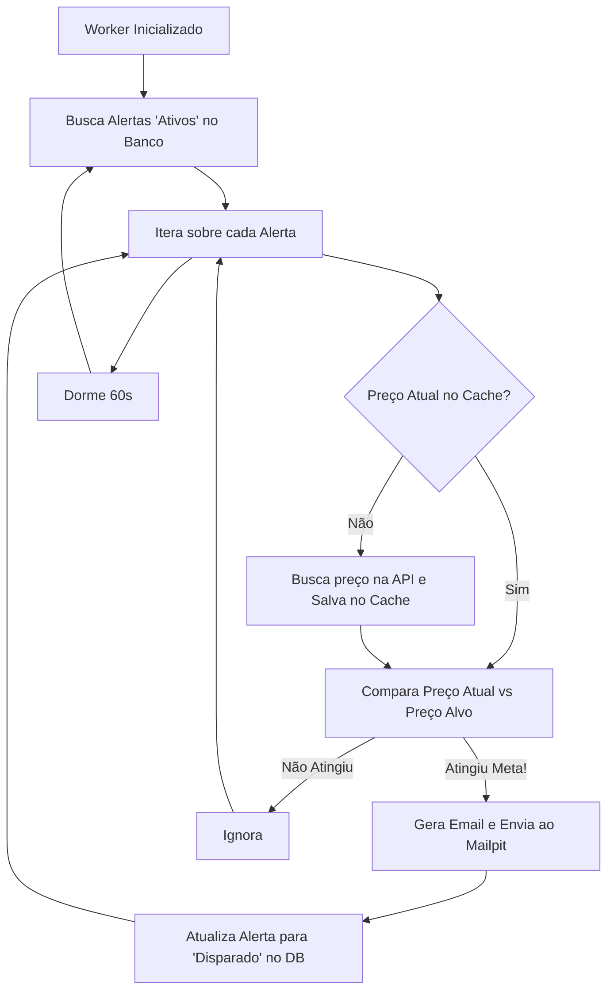
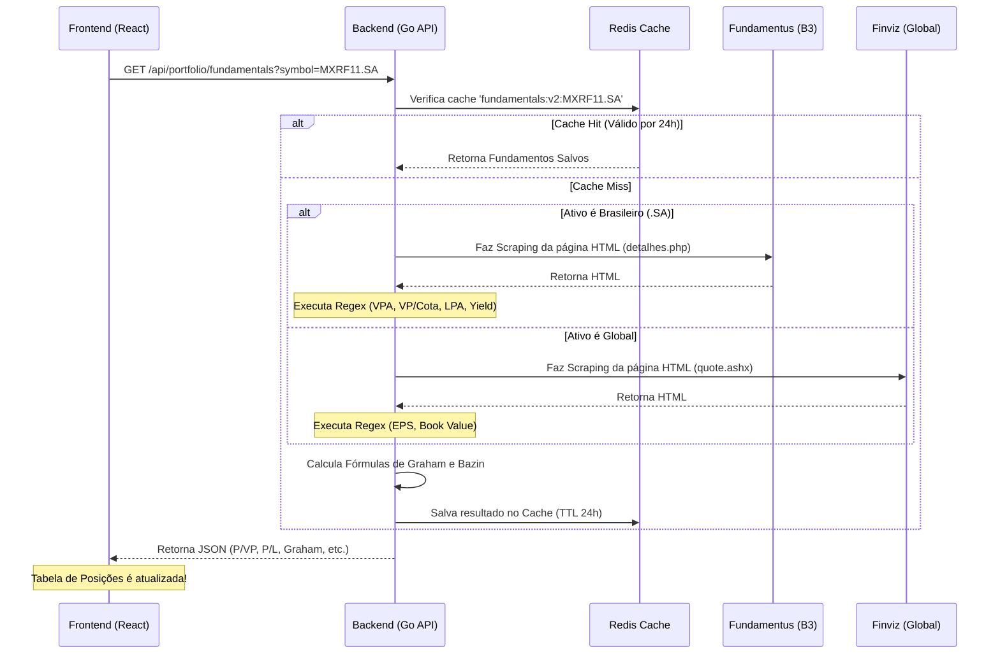
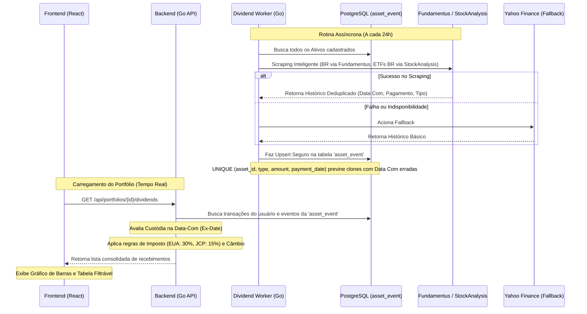

# stock-pulse 📈

stock-pulse é uma plataforma moderna e completa para acompanhamento de portfólios de investimentos, listas de favoritos (watchlists) e configuração de alertas de preços em tempo real. O sistema possui arquitetura baseada em micro-serviços orquestrados via Docker, com um backend robusto em Golang e um frontend moderno em Next.js.

## 🚀 Funcionalidades

- **Monitoramento em Tempo Real:** Conexões via WebSocket garantem que cotações de ativos pisquem na tela sem necessidade de recarregar a página.
- **Gestão de Portfólio Modular:** Acompanhe rentabilidade, histórico de transações e custo médio dos seus ativos globais ou da B3. A interface do portfólio é organizada em abas (Visão Geral de Renda Variável, Renda Fixa, Transações, Proventos, Diário) garantindo uma experiência de usuário limpa e fluida. Suporta edição de transações, Desdobramentos/Agrupamentos (Splits), Bonificações e Importação em Lote (Bulk Import via CSV).
- **Renda Fixa Integrada:** Módulo dedicado para acompanhamento de Renda Fixa (como CDBs), com gráfico exclusivo de evolução de juros compostos e tabela padronizada de posições e rentabilidade líquida, totalmente isolado da curva da Renda Variável.
- **Precisão Matemática e Backtesting:** Motor de rentabilidade inteligente com "Olhar do Futuro". Desdobramentos e agrupamentos futuros são retroativamente calculados nas suas quantidades históricas, garantindo que o seu gráfico de Evolução Patrimonial empate perfeitamente com as cotações "Split-Adjusted" do Yahoo Finance, prevenindo falsos picos de lucros ou perdas.
- **Watchlists Múltiplas:** Crie listas de favoritos customizadas para separar ativos por estratégia.
- **Bot Integrado do Telegram:** Interaja com a sua carteira e receba relatórios financeiros completos diretamente pelo chat do Telegram, com interface rica (menus inline paginados, agrupamentos anuais e mensais de proventos, e filtros dinâmicos de próximos pagamentos), sem poluição visual.
- **Valuation e Indicadores (P/VP, P/L, Yield):** Calcule o Preço Justo de ações segundo as metodologias de Benjamin Graham e Décio Bazin. Acompanhe em tempo real na sua tabela de posições ativas os múltiplos P/VP, P/L e Dividend Yield atualizados via scraping (suporte inteligente a Ações e FIIs da B3 via Fundamentus, e ativos globais via Finviz). Receba alertas visuais diretamente na tabela identificando oportunidades (ex: P/VP < 1.0 ou preços descontados ficam destacados em verde).
- **Visualização Avançada de Histórico:** Histórico de transações em layout fluido (single-line), com filtros inteligentes por Ticker para auditar operações e custos passados com facilidade. Além de uma exclusiva coluna de **Impacto Diário em Reais** na tela inicial para medir rapidamente o real ganho/perda de cada ativo na carteira no dia corrente.
- **Alertas de Preço (E-mail e Telegram):** Configure alertas disparados automaticamente em background quando um preço atinge uma meta, recebendo notificações em tempo real.
- **Segurança Sólida:** Autenticação usando JWT armazenado exclusivamente em cookies `HttpOnly` com criptografia e regras de CORS restritas.
- **Observabilidade Total:** Telemetria integrada com Prometheus, Grafana e Loki para métricas e logs em tempo real.

---

## 🛠️ Stack Tecnológico

### Backend (Golang 1.24)
- **Roteamento & HTTP:** `go-chi`
- **Banco de Dados Relacional:** PostgreSQL 16 (driver `pgx/v5` via pool de conexões)
- **Cache & Sessão:** Redis 7 (`go-redis/v9`)
- **Autenticação:** JWT (JSON Web Tokens)
- **Migrações de DB:** `golang-migrate`
- **Fornecedor de Dados de Mercado:** Yahoo Finance API (Cotações e Busca), Fundamentus & Finviz (Scraping de Fundamentos)
- **Background Workers:** Goroutines para verificação de alertas e rotinas de portfólio.

### Frontend (Next.js 14)
- **Framework:** React 18 com TypeScript
- **Estilização:** CSS puro ("Glassmorphism", interfaces dark mode premium)
- **Gráficos:** Lightweight Charts (TradingView)
- **Testes Unitários:** Vitest & React Testing Library (100% de cobertura)
- **Testes E2E:** Playwright

### Infraestrutura & DevOps
- **Orquestração:** Docker Compose
- **Proxy Reverso:** Caddy (Roteamento local e compressão gzip/zstd)
- **Mensageria SMTP:** Mailpit (Para captura de e-mails em desenvolvimento)
- **Monitoramento:** Prometheus, Grafana, Loki e Promtail.

---

## 📡 Fornecedores de Dados (Data Providers)

O stock-pulse não possui uma base de dados interna estática de ativos financeiros. Ele atua de forma dinâmica buscando informações atualizadas (Cotações e Fundamentos) através de integrações com APIs e Web Scraping:

### 1. Yahoo Finance API (Cotações e Busca)
Responsável por entregar as cotações em tempo real e fornecer a busca (autocomplete) de ativos.
- **Busca de Tickers (Search):**
  - `GET https://query1.finance.yahoo.com/v1/finance/search?q={query}`
- **Cotação Atual e Preço de Fechamento (Chart/Quote):**
  - `GET https://query1.finance.yahoo.com/v8/finance/chart/{symbol}?interval=1d&range=1d`
  
*(Nota: Para evitar bloqueios do Yahoo Finance, o backend injeta rotineiramente cabeçalhos `User-Agent` customizados nas requisições).*

### 2. Fundamentus (Scraping de Fundamentos e Proventos - Brasil)
Como as APIs gratuitas do Yahoo não fornecem indicadores fundamentalistas estruturados e nem histórico de dividendos 100% confiáveis para o Brasil, o backend faz o web scraping das páginas do Fundamentus para ativos com o sufixo `.SA` (Ações e FIIs da B3).
- **Fundamentos:** Extração via Regex de VPA, VP/Cota, LPA e Yield (`/detalhes.php`).
- **Histórico de Proventos:** Extração da tabela de dividendos (`/proventos.php`), utilizando um **Motor de Deduplicação Heurística** que limpa dados sujos da fonte:
  - **Regra de FIIs:** Garante e agrupa apenas 1 pagamento de rendimento por mês.
  - **Regra de Ações:** Diferencia e preserva pagamentos múltiplos baseando-se no valor exato do provento.

### 3. Finviz (Scraping de Fundamentos - Global)
Para ativos americanos ou globais (sem o sufixo `.SA`), o sistema roteia o scraping para o portal Finviz, que possui uma tabela rica de indicadores de mercado internacional.
- **Endpoint Analisado:**
  - `GET https://finviz.com/quote.ashx?t={symbol}`
- **Métricas Extraídas via Regex:** EPS (ttm), Book/sh e Dividend %.

### 4. StockAnalysis (Scraping de Proventos - Fallback Global e ETFs Brasileiros)
Utilizado primariamente para recuperar o histórico de dividendos de ativos globais, mas estendido como fallback crucial para ETFs brasileiros (ex: `SPYI11.SA` ou `BNDX11.SA`) que não possuem informações no Fundamentus.
- **Endpoint Global:** `/stock/{symbol}/dividend`
- **Endpoint B3:** `/quote/bvmf/{symbol}/dividend`
- **Métricas:** Para ativos brasileiros na B3, priorizamos a coluna **Record Date** (Data Com) no lugar da *Ex-Dividend Date* tradicional americana, refletindo perfeitamente a legislação financeira nacional.

---

### Importação de Transações em Lote (CSV)
O stock-pulse permite a importação massiva de histórico de operações através de um arquivo `.csv` ou `.txt`. 
O arquivo deve conter as colunas na seguinte ordem exata (o cabeçalho na primeira linha é ignorado):

`DATE, TICKER, TYPE, QUANTITY, PRICE`

- **DATE**: Formato internacional (`YYYY-MM-DD`) ou brasileiro (`DD/MM/YYYY`).
- **TICKER**: Código do ativo (ex: `PETR4.SA`, `AAPL`).
- **TYPE**: Define o comportamento das colunas Quantidade e Preço:
  - **`BUY` (Compra):** Quantidade e Preço devem ser maiores que zero.
  - **`SELL` (Venda):** Quantidade e Preço devem ser maiores que zero.
  - **`BONUS` (Bonificação):** Quantidade (ações recebidas) > 0. O preço deve ser o **Custo Atribuído** (declarado pela empresa no Fato Relevante). O sistema usará este valor para aumentar o seu custo total e recalcular o Preço Médio (se preferir não alterar o custo, informe `0.00`).
  - **`SPLIT` (Desdobramento):** Quantidade representa o fator de multiplicação (ex: `2` para 1 virar 2). O sistema ignora o preço (pode informar `0.00`).
  - **`REVERSE_SPLIT` (Agrupamento):** Quantidade representa o fator de divisão (ex: `10` para 10 virar 1). O sistema ignora o preço (pode informar `0.00`).

**Exemplo Completo de Arquivo CSV:**
```csv
DATE, TICKER, TYPE, QUANTITY, PRICE
2024-01-10, WEGE3, BUY, 100, 32.50
2024-02-15, WEGE3, SELL, 50, 38.00
2024-03-01, PETR4, BUY, 200, 35.10
2024-04-10, PETR4, BONUS, 20, 0.00
2024-05-20, ITUB4, SPLIT, 2, 0.00
2024-06-15, COGN3, REVERSE_SPLIT, 10, 0.00
```

---

## 📊 Arquitetura e Fluxos de Dados

Para entender melhor como os serviços se comunicam sob o capô, abaixo estão os diagramas de arquitetura e dos fluxos principais.

### 1. Diagrama de Blocos (Alto Nível)
Representa a orquestração via Docker Compose e como o tráfego externo é roteado até os provedores de dados.



### 2. Fluxo de Cotações em Tempo Real (WebSockets)
Como o sistema entrega piscadas na tela instantaneamente ao cliente.



### 3. Fluxograma de Alertas (Background Workers)
Goroutines rodando infinitamente em background para checar se o preço atingiu o alvo configurado.



### 4. Fluxo de Scraping de Fundamentos e Valuation
Como o sistema recupera e exibe em tempo real indicadores pesados (P/VP, P/L, Yield) sem sobrecarregar provedores lentos.


### 5. Fluxo de Processamento de Proventos (Dividendos)
Para evitar lentidão na interface e limites de API, os eventos de proventos são processados em background e calculados de forma cruzada com a custódia do usuário.



---

## 📂 Arquitetura do Repositório (Monorepo)

```text
.
├── backend/          # Backend em Go (Domain-Driven Design)
│   ├── cmd/api/      # Ponto de entrada (main.go)
│   ├── internal/     # Regras de negócio (auth, market, portfolio, alert, websocket, etc.)
│   ├── migrations/   # Scripts SQL de versionamento do banco
│   └── Dockerfile    # Imagem Go com Air para Live Reload
│
├── frontend/         # Interface Web em Next.js
│   ├── src/app/      # Páginas (Login, Dashboard, Portfólio)
│   ├── tests/        # Testes End-to-End com Playwright
│   └── Dockerfile    # Imagem Node.js
│
├── docker-compose.yml # Arquivo principal que sobe 9 containers integrados
├── Makefile          # Atalhos para comandos comuns
└── Caddyfile         # Configuração de rotas para proxy reverso
```

---

## 🤖 Configuração do Telegram Bot

Para que a integração com o Telegram funcione, você precisa criar um bot e obter um token de acesso oficial. O processo leva menos de dois minutos:

1. Abra o seu aplicativo do Telegram e busque pelo usuário oficial **@BotFather**.
2. Envie o comando `/newbot` e siga as instruções para escolher um nome e um username para o seu bot (obrigatoriamente precisa terminar com `_bot`).
3. Ao finalizar, o BotFather te entregará um **Token HTTP API** (uma string longa parecida com `123456789:ABCdefGHIjklmNOPqrsTUVwxyz`).
4. Na raiz do projeto, abra (ou crie) o seu arquivo `.env` baseado no `.env.example`.
5. Cole o token na variável `TELEGRAM_BOT_TOKEN`, por exemplo:
   ```env
   TELEGRAM_BOT_TOKEN=123456789:ABCdefGHIjklmNOPqrsTUVwxyz
   ```

Pronto! Com o Token preenchido, assim que você subir a aplicação, o módulo de conversação do Telegram será ativado automaticamente. Ao iniciar um chat enviando `/start`, o bot entregará um link seguro para você vincular sua conta da plataforma Web com o celular.

---

## ⚙️ Como Executar Localmente

### Pré-requisitos
- Docker e Docker Compose instalados.
- Make instalado (Opcional, mas recomendado).

### Subindo o Ambiente

Apenas clone o repositório e utilize o Makefile na raiz do projeto:

```bash
# Para compilar e subir todos os containers (DB, Redis, Go, Next, Grafana, Mailpit...)
make build

# Para subir sem recompilar:
make up

# Para acompanhar os logs de todos os serviços:
make logs

# Para rodar a suíte de testes E2E automatizada (requer ambiente local no ar):
make e2e

# Para derrubar o ambiente:
make down
```

### Acessos Locais Pós-Deploy

O `Caddy` vai expor os serviços de forma elegante:

- **Frontend (Interface do Usuário):** [http://stock-pulse.localhost](http://stock-pulse.localhost) ou [http://localhost:3000](http://localhost:3000)
- **Backend (API Base):** [http://api.stock-pulse.localhost](http://api.stock-pulse.localhost) ou [http://localhost:8080](http://localhost:8080)
- **Mailpit (Caixa de Entrada Local para Alertas):** [http://localhost:8025](http://localhost:8025)
- **Grafana (Dashboards de Monitoramento):** [http://localhost:3001](http://localhost:3001) (Usuário/Senha Padrão: admin / admin)

---

## 🏗️ Como Criar Novas Migrações do Banco de Dados

Se você modificar a estrutura do banco de dados, crie uma nova migração utilizando o atalho do Makefile:

```bash
make migrate-create
```
*O console pedirá o nome da migração (ex: `add_users_table`) e gerará os arquivos `.up.sql` e `.down.sql` na pasta `backend/migrations`.*

---

## 🛡️ Segurança e Boas Práticas Implementadas

- Proteção JWT imune a ataques XSS através de Cookies `HttpOnly`.
- Validação CSRF com Strict/Lax SameSite modes.
- Fallback elegante se os provedores externos (Yahoo Finance) aplicarem Rate Limits, utilizando cache em Redis.
- Graceful Shutdown no Go para desligar os Background Workers e encerrar conexões com o PostgreSQL com segurança.

---

## 🧪 Testes e Cobertura (Unit Testing)

A plataforma stock-pulse foca em **alta qualidade de código**, visando 100% de cobertura nos testes unitários tanto no backend quanto no frontend.

### Backend (Golang)
O backend possui um conjunto rigoroso de testes simulando casos de sucesso e tratamento de erros avançados no banco de dados com `pgxmock` (simulação de erros em scan de rows, indisponibilidade, etc).
```bash
# Rodar todos os testes de backend localmente
cd backend
go test -v -coverprofile=coverage.out ./...

# Ou rodar via Docker (sem precisar ter Go instalado localmente)
make test-backend
```

### Frontend (Next.js)
O frontend conta com cobertura de testes utilizando `Vitest` em conjunto com a `React Testing Library`. A suíte realiza _smoke testing_, testes de layout, validações de fluxo de formulários (Login e Registro) e _mocking_ de providers e contextos.
```bash
# Rodar testes de frontend localmente
cd frontend
npm run test:coverage

# Ou rodar via Docker (sem precisar ter Node instalado localmente)
make test-frontend
```

### Testes End-to-End (E2E)
A validação de fluxos reais de usuário é garantida através do **Playwright**. Em vez de duplicar a arquitetura criando containers específicos e pesados para E2E, o sistema conta com uma solução de infraestrutura inteligente e limpa:
- **`scripts/run-e2e.sh`**: Script unificado que gerencia todo o ciclo de vida dos testes E2E.
- **Isolamento Dinâmico**: O script reaproveita a instância ativa do PostgreSQL, criando e provisionando sob demanda um *schema/database* chamado `stockpulse_test`. Em seguida, reinicia exclusivamente o backend de testes com a injeção da flag `MOCK_EXTERNAL_APIS=true` para garantir testes imunes a oscilações de mercado e bloqueios do Yahoo Finance. Ao final dos testes, o backend original é restaurado e o banco de testes é destruído, mantendo o ambiente de dev intacto.

```bash
# Rodar todos os testes E2E com isolamento automático de banco de dados
make e2e
```

## ☁️ Arquitetura de Deploy (Cloud Gratuita)

O **stock-pulse** foi desenhado para ser facilmente distribuído em serviços de nuvem gratuitos (Free Tiers), permitindo que você hospede seu próprio ambiente de produção com **custo zero**:

- **Frontend:** [Vercel](https://vercel.com/) (Hospedagem nativa Next.js, Serverless & CDN Global)
- **Backend (API/Workers):** [Koyeb](https://koyeb.com/) (Serviço Eco gratuito para containers Docker rodando as rotinas 24/7) ou Google Cloud Platform (VM `e2-micro` Always Free)
- **Banco de Dados:** [Supabase](https://supabase.com/) (PostgreSQL dedicado gratuito de 500MB, backups diários)
- **Cache & WebSockets:** [Redis Cloud](https://redis.com/try-free/) (Cluster gerenciado de 30MB gratuito, ideal para cache temporário de cotações)

Com essa distribuição, o sistema evita gargalos de memória e ganha resiliência, separando a persistência (Supabase) da lógica computacional (Go) e da entrega de interface (Vercel).

---

## ⚖️ Licença

Este projeto está licenciado sob a **AGPLv3 (GNU Affero General Public License v3.0)**.
Isto significa que o código é aberto e livre, mas qualquer modificação ou obra derivada, caso seja distribuída ou hospedada como um serviço web, obrigatoriamente deve ter seu código-fonte aberto sob os mesmos termos. O uso privado sem abertura de código é proibido para serviços públicos de rede.

Consulte o arquivo [`LICENSE`](LICENSE) para mais detalhes.
