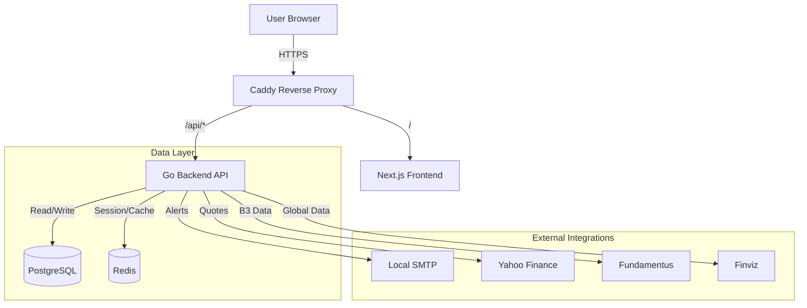
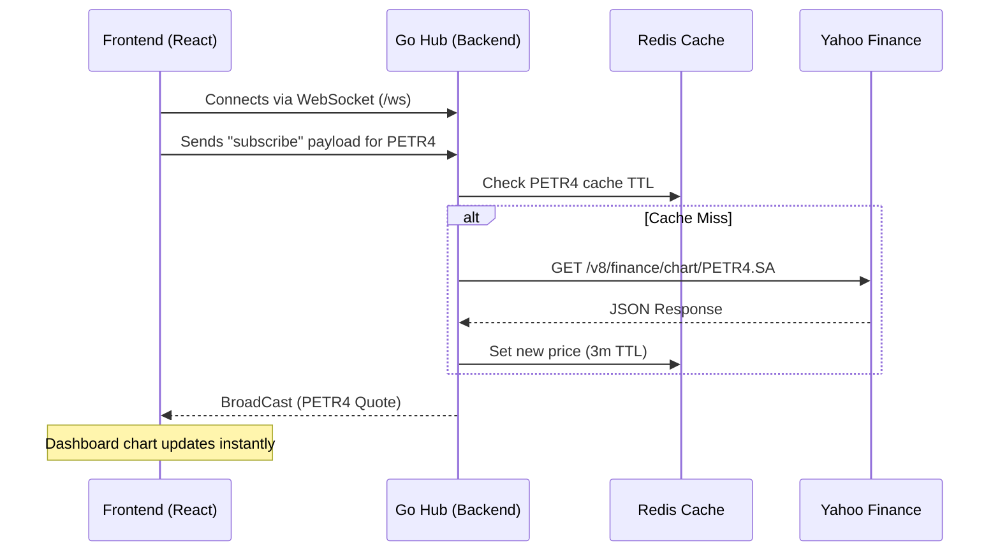
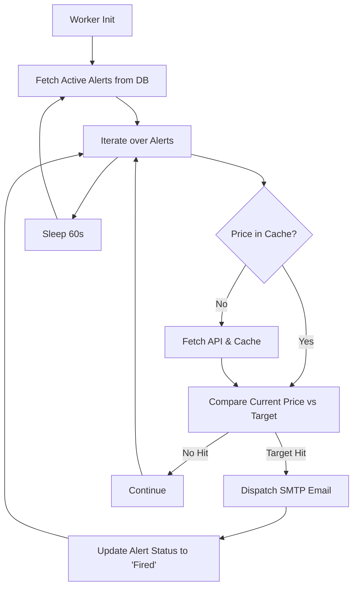
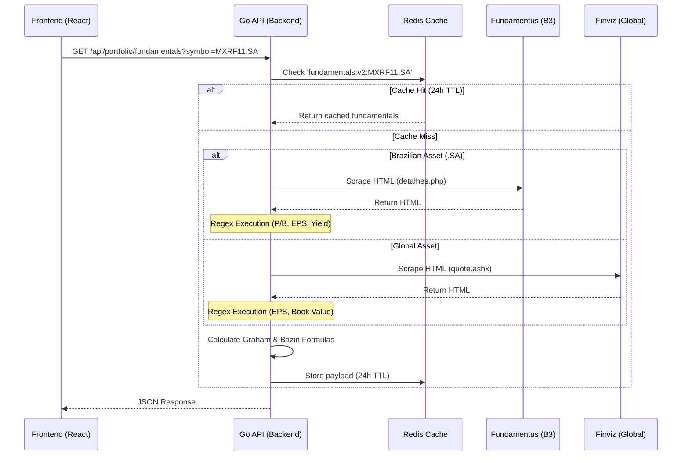
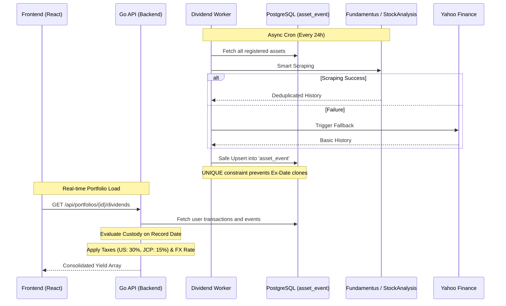
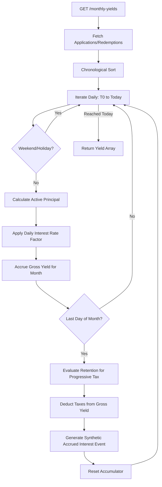

# stock-pulse 📈

stock-pulse is a comprehensive portfolio management and financial monitoring platform. The system features a microservices architecture orchestrated via Docker, composed of a robust Golang backend and a modern Next.js frontend, providing real-time pricing, watchlist tracking, and automated alert systems.

## 🚀 Core Features

- **Real-Time Data Streaming:** WebSocket connections ensure real-time asset price updates without page reloads.
- **Modular Portfolio Management:** Track profitability, transaction history, and average costs for global and B3 (Brazilian) assets. The interface is modularized into Variable Income, Fixed Income, Transactions, Dividends, and Journal views. Supports native transaction editing, stock splits, reverse splits, bonuses, and bulk import via CSV.
- **Dedicated Fixed Income Engine:** An isolated module for Fixed Income tracking (e.g., CDBs, Treasury Bonds) featuring exclusive compound interest evolution charts and standardized net yield tables. Includes a daily yield simulator that integrates **Accumulated Monthly Yields** (discounting progressive tax and IOF) directly into the Dividends view, displaying accrued interest as stacked payments.
- **Mathematical Precision & Backtesting:** A forward-looking profitability engine retroactively calculates future splits and reverse splits on historical quantities, aligning perfectly with "Split-Adjusted" data from Yahoo Finance to prevent false profit/loss spikes.
- **Multiple Watchlists:** Create customized watchlists for diverse investment strategies.
- **Integrated Telegram Bot:** Two-way Telegram interaction allowing users to fetch full financial reports, charts, and filter dynamic views natively within the chat. Supports multi-portfolio management by securely storing session context via Redis.
- **Valuation & Fundamentals (P/B, P/E, Yield):** Real-time calculation of intrinsic value based on Benjamin Graham and Décio Bazin models. Live fundamental indicators are retrieved via web scraping (Fundamentus for B3, Finviz for Global).
- **Unified Transaction Ledger:** A single-line layout consolidating Variable Income and Fixed Income operations with advanced filtering by module, ticker, and date. Features a native "Daily Real Impact" column to instantly measure the daily P&L contribution of each asset.
- **Asynchronous Price Alerts:** Background workers continuously monitor user-defined price targets, triggering instant email and Telegram notifications.
- **Robust Security:** JWT-based authentication stored exclusively in `HttpOnly` and `Secure` cookies, alongside strict CORS and CSRF configurations.
- **Full Observability:** Integrated telemetry using Prometheus, Grafana, and Loki for real-time metrics and log aggregation.

---

## 🛠️ Technology Stack

### Backend (Golang 1.24)
- **Routing & HTTP:** `go-chi`
- **Relational Database:** PostgreSQL 16 (`pgx/v5` connection pool)
- **Cache & Session State:** Redis 7 (`go-redis/v9`)
- **Authentication:** JWT (JSON Web Tokens) & Argon2id Hashing
- **Migrations:** `golang-migrate`
- **Market Data Providers:** Yahoo Finance API (Quotes/Search), Fundamentus & Finviz (Scraping)
- **Concurrency:** Goroutine-based background workers for alerts, dividends, and portfolio backfills.

### Frontend (Next.js 14)
- **Framework:** React 18 with TypeScript
- **Styling:** Vanilla CSS (Glassmorphism, Dark Mode)
- **Charting:** Lightweight Charts (TradingView)
- **Unit Testing:** Vitest & React Testing Library (100% Coverage)
- **E2E Testing:** Playwright

### Infrastructure & DevOps
- **Orchestration:** Docker Compose
- **Reverse Proxy:** Caddy (Local routing, gzip/zstd compression)
- **SMTP Testing:** Mailpit
- **Monitoring:** Prometheus, Grafana, Loki, and Promtail

---

## 📡 Data Providers Integration

stock-pulse operates dynamically, fetching updated market data (Quotes and Fundamentals) via external API integrations and Web Scraping:

### 1. Yahoo Finance API (Quotes and Search)
Provides real-time quotes and asset autocomplete functionality.
- **Search:** `GET https://query1.finance.yahoo.com/v1/finance/search?q={query}`
- **Quote/Chart:** `GET https://query1.finance.yahoo.com/v8/finance/chart/{symbol}?interval=1d&range=1d`

### 2. Fundamentus (B3 Fundamentals & Dividends)
Used to extract structured fundamentals for Brazilian assets (`.SA` suffix).
- **Fundamentals:** Regex extraction of P/B, EPS, and Yield (`/detalhes.php`).
- **Dividends History:** Extraction and sanitization via a **Heuristic Deduplication Engine** to clean raw source data.

### 3. Finviz (Global Fundamentals)
Routes global assets to Finviz for comprehensive international market indicators.
- **Endpoint:** `GET https://finviz.com/quote.ashx?t={symbol}`

### 4. StockAnalysis (Fallback for Global & B3 ETFs)
Primary provider for global dividends and critical fallback for Brazilian ETFs missing from Fundamentus.
- Prioritizes the **Record Date** over the Ex-Dividend Date for Brazilian assets to comply with national financial legislation.

---

## 💱 Multi-Currency Architecture & Exchange Rates

To support native multi-currency portfolios (e.g., a USD portfolio purchasing BRL assets), the system relies on an Exchange Rate multiplier:

`Total Transaction Cost = Quantity × Unit Price × Exchange Rate`

- **Domestic Assets (Same currency as portfolio):** Exchange rate is enforced as `1.0`.
- **International Assets (Different currency):** The system automatically fetches historical exchange rates at the exact transaction date, permanently anchoring the asset's total cost to the portfolio's base currency and shielding the average price from future FX volatility.

---

## 📦 Bulk CSV Import Specification

stock-pulse supports massive historical data ingestion via `.csv` or `.txt`.
Required column format (header row is ignored):

`DATE, TICKER, TYPE, QUANTITY, PRICE`

- **DATE**: `YYYY-MM-DD` or `DD/MM/YYYY`.
- **TYPE**:
  - `BUY` / `SELL`: Standard transactions.
  - `BONUS`: Stock bonuses. Quantity represents shares received; Price defines assigned cost.
  - `SPLIT` / `REVERSE_SPLIT`: Corporate actions. Quantity defines the multiplier/divisor.

---

## 📊 Architecture & Data Workflows

For an in-depth understanding of the internal microservices communication and architectural patterns, refer to the detailed documentation:

- 👉 [🔐 Authentication & Security (Auth, JWT, HttpOnly Cookies)](docs/architecture/auth.md)
- 👉 [🚑 Portfolio Systemic Auto-Healing (BackfillGap & LOCF)](docs/architecture/portfolio_healing.md)
- 👉 [📦 Transactional Bulk Import Workflow](docs/architecture/bulk_import.md)
- 👉 [🤖 Telegram Bot Bidirectional Integration & State Management](docs/architecture/telegram_bot.md)

### 1. High-Level Block Diagram
Illustrates Docker Compose orchestration and external routing.



### 2. Real-Time Quotes Flow (WebSockets)



### 3. Asynchronous Alert Workers



### 4. Fundamentals Scraping & Valuation Engine



### 5. Dividend Processing Workflow



### 6. Fixed Income Monthly Yield Simulation



---

## 📂 Monorepo Architecture

```text
.
├── backend/          # Golang Backend (Domain-Driven Design)
│   ├── cmd/api/      # Entry point
│   ├── internal/     # Core logic (auth, market, portfolio, alerts, etc.)
│   ├── migrations/   # SQL Schema definitions
│   └── Dockerfile    # Go image with Air (Live Reload)
│
├── frontend/         # Next.js Web Interface
│   ├── src/app/      # Application Routing
│   ├── tests/        # Playwright E2E Tests
│   └── Dockerfile    # Node.js build image
│
├── docker-compose.yml # 9-container orchestrated environment
├── Makefile          # Automation shortcuts
└── Caddyfile         # Reverse proxy configurations
```

---

## 🤖 Telegram Bot Configuration

1. Locate **@BotFather** on Telegram.
2. Send `/newbot` and follow prompts to retrieve an **HTTP API Token**.
3. Create a `.env` file based on `.env.example`.
4. Inject the token: `TELEGRAM_BOT_TOKEN=your_token_here`.
5. Upon application startup, the Telegram module engages automatically. Sending `/start` to the bot will initialize the secure binding process.

---

## ⚙️ Local Development Setup

### Prerequisites
- Docker and Docker Compose.
- Make (Recommended).

### Deployment

```bash
# Build and orchestrate all containers (DB, Redis, Go, Next, Grafana, Mailpit)
make build

# Start environment
make up

# Tail logs
make logs

# Execute E2E automated test suite
make e2e

# Tear down environment
make down
```

### Local Endpoints
- **Frontend:** [http://stock-pulse.localhost](http://stock-pulse.localhost) or `localhost:3000`
- **Backend API:** [http://api.stock-pulse.localhost](http://api.stock-pulse.localhost) or `localhost:8080`
- **Mailpit:** [http://localhost:8025](http://localhost:8025)
- **Grafana:** [http://localhost:3001](http://localhost:3001) (admin / admin)

---

## 🏗️ Database Migrations

Generate new schema migrations via Makefile:
```bash
make migrate-create
```
*(Prompts for migration name and generates `.up.sql` / `.down.sql` in `backend/migrations`).*

---

## 🧪 Testing & Coverage

### Backend (Golang)
Rigorous unit testing covering success and database failure states via `pgxmock`.
```bash
cd backend
go test -v -coverprofile=coverage.out ./...
# Or via Docker: make test-backend
```

### Frontend (Next.js)
UI component testing and flow validation using `Vitest` and `React Testing Library`.
```bash
cd frontend
npm run test:coverage
# Or via Docker: make test-frontend
```

### End-to-End (E2E)
Robust validation using **Playwright**.
- **Dynamic Database Isolation:** `scripts/run-e2e.sh` automatically provisions an ephemeral `stockpulse_test` PostgreSQL schema. It restarts the backend with `MOCK_EXTERNAL_APIS=true` to ensure market data immutability during test cycles, tearing down the environment upon completion.
```bash
make e2e
```

---

## ☁️ Free-Tier Cloud Deployment Architecture

Designed for zero-cost deployment across globally distributed free-tier platforms:
- **Frontend:** [Vercel](https://vercel.com/) (Serverless Next.js, Global CDN)
- **Backend:** [Koyeb](https://koyeb.com/) (Free Eco Docker container) or GCP `e2-micro`.
- **Database:** [Supabase](https://supabase.com/) (500MB Dedicated PostgreSQL)
- **Cache & WebSockets:** [Redis Cloud](https://redis.com/try-free/) (30MB Managed Cluster)

---

## ⚖️ License

Licensed under the **AGPLv3 (GNU Affero General Public License v3.0)**.
Source code must remain open. Any modifications or derivative works hosted as web services must strictly open-source their underlying code under identical terms.

See the [`LICENSE`](LICENSE) file for comprehensive details.
