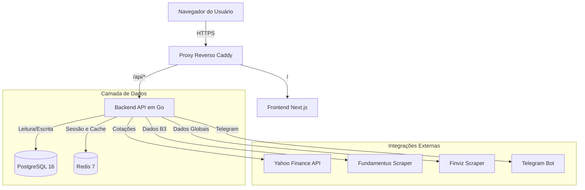
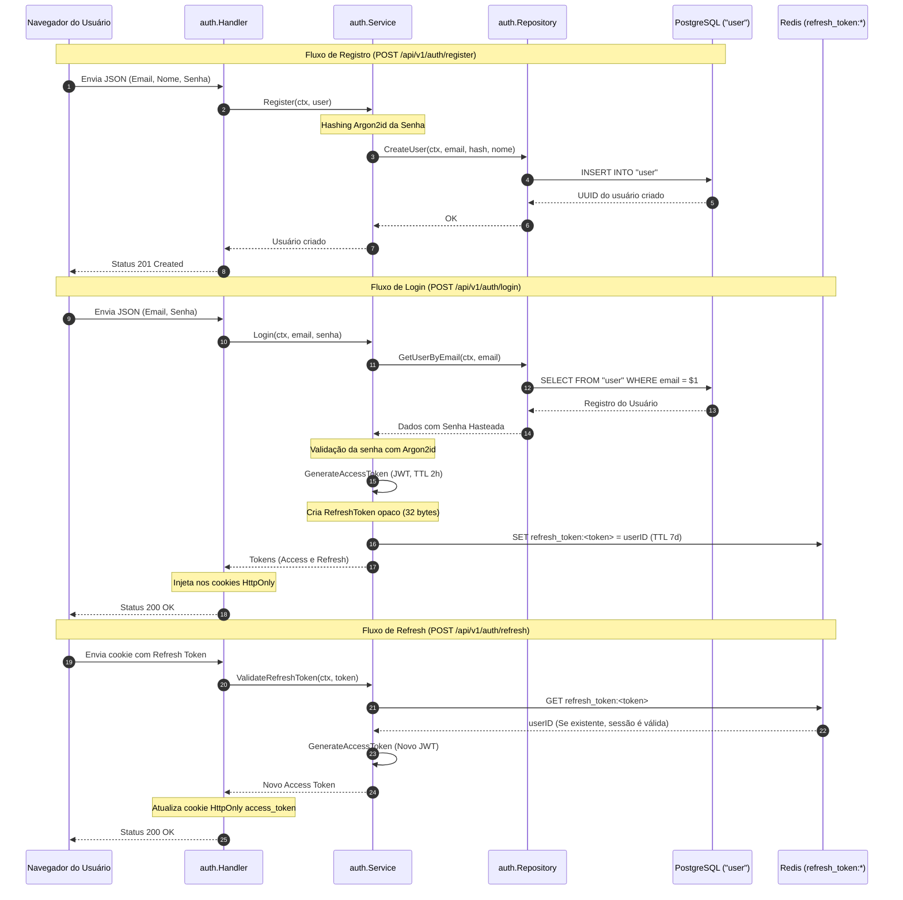
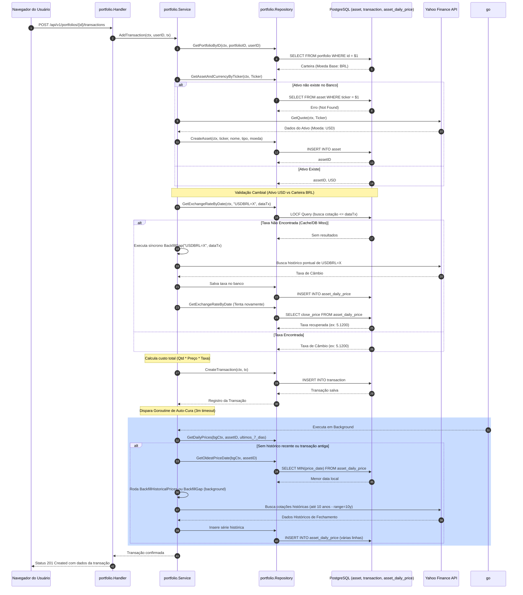
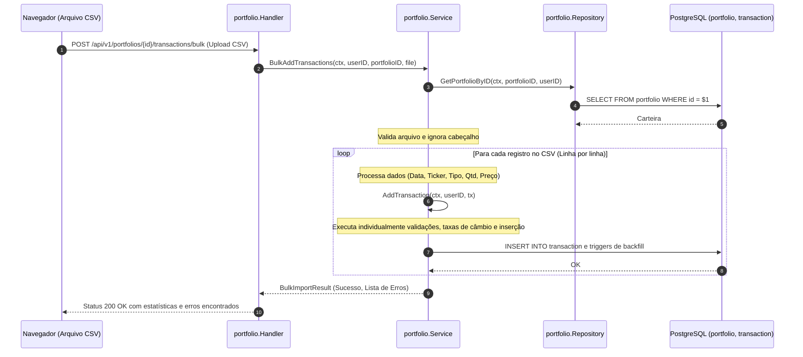
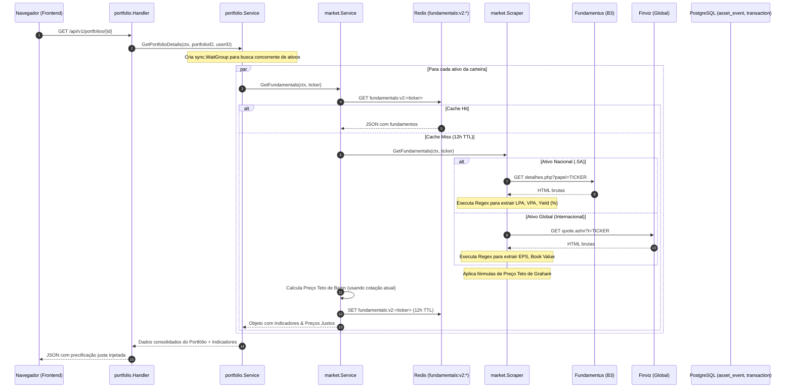
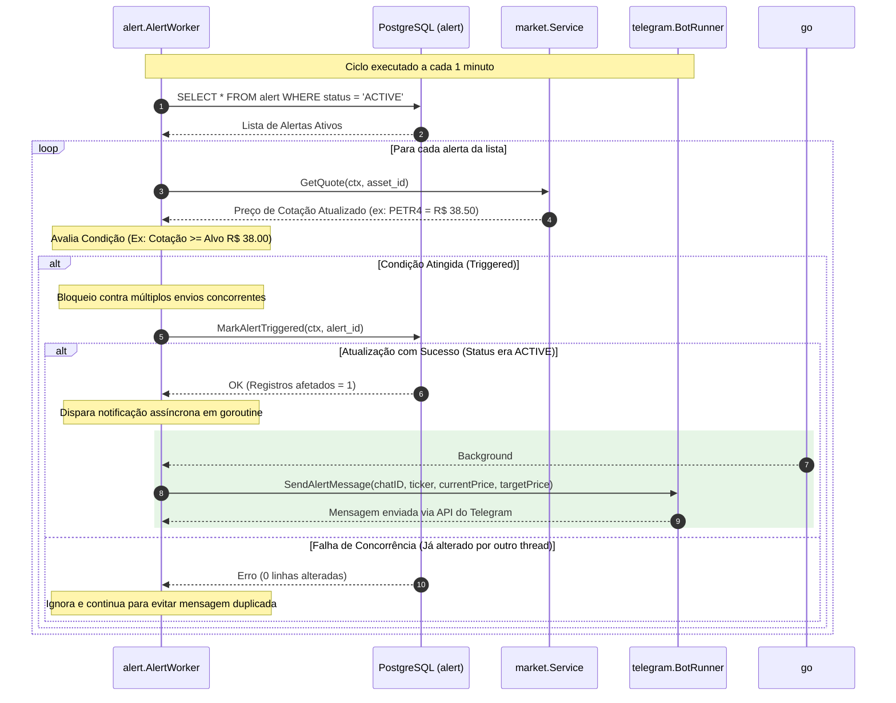
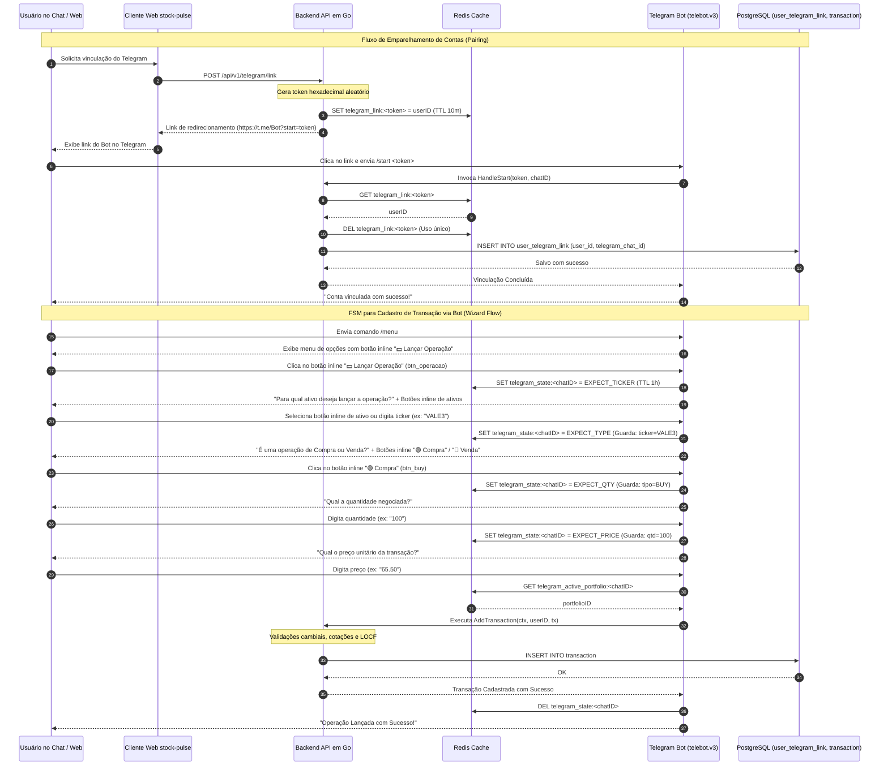

# stock-pulse 📈

O **stock-pulse** é uma plataforma abrangente de gestão de carteiras e monitoramento financeiro. O sistema apresenta uma arquitetura moderna composta por um backend robusto em Golang e um frontend moderno em Next.js, orquestrados via Docker Compose. Ele fornece cotações em tempo real, rastreamento de listas de favoritos (watchlists), processamento e projeção de renda fixa, scraping de dados fundamentais, sistemas de alertas de preço automatizados por e-mail e integração bidirecional com bot do Telegram.

---

## 📑 Índice de Navegação
- [🚀 Funcionalidades Core (Core Features)](#funcionalidades-core-core-features)
- [🛠️ Stack Tecnológica](#stack-tecnológica)
  - [Backend (Golang 1.24)](#backend-golang-124)
  - [Frontend (Next.js 14)](#frontend-nextjs-14)
  - [Infraestrutura e DevOps](#infraestrutura-e-devops)
- [📡 Integração com Provedores de Dados](#integração-com-provedores-de-dados)
- [💱 Arquitetura Multimoeda e Taxas de Câmbio](#arquitetura-multimoeda-e-taxas-de-câmbio)
- [📦 Especificação de Importação de Arquivos CSV](#especificação-de-importação-de-arquivos-csv)
- [📊 Arquitetura Global e Modelagem de Dados](#arquitetura-global-e-modelagem-de-dados)
- [🔍 Detalhamento de Módulos Core](#detalhamento-de-módulos-core)
  - [1. Autenticação e Segurança (Auth)](#1-autenticação-e-segurança-auth)
  - [2. Inserção de Transações e Auto-Cura (Transactions, Bulk Import & Backfill)](#2-inserção-de-transações-e-auto-cura-transactions-bulk-import--backfill)
  - [3. Scraping e Motor de Avaliação (Fundamentals & Valuation)](#3-scraping-e-motor-de-avaliação-fundamentals--valuation)
  - [4. Trabalhadores em Segundo Plano (Background Workers)](#4-trabalhadores-em-segundo-plano-background-workers)
  - [5. Integração com Bot do Telegram (Telegram Bot)](#5-integração-com-bot-do-telegram-telegram-bot)
- [📂 Arquitetura do Repositório (Monorepo Layout)](#arquitetura-do-repositório-monorepo-layout)
- [⚙️ Configuração e Desenvolvimento Local](#configuração-e-desenvolvimento-local)
- [🏗️ Migrações de Banco de Dados](#migrações-de-banco-de-dados)
- [🧪 Testes Automatizados e Cobertura](#testes-automatizados-e-cobertura)
- [☁️ Arquitetura de Implantação Cloud Free-Tier](#arquitetura-de-implantação-cloud-free-tier)
- [⚖️ Licença (License)](#licença-license)

---

## 🚀 Funcionalidades Core (Core Features)

- **Streaming de Dados em Tempo Real:** Conexões via WebSockets garantem atualizações instantâneas dos preços dos ativos no painel do usuário sem a necessidade de recarregar a página.
- **Gestão de Carteiras Modular:** Acompanhe a rentabilidade, o histórico de transações e o preço médio de ativos nacionais (B3) e internacionais. A interface é modularizada nas seções de Renda Variável, Renda Fixa, Transações, Dividendos e Diário de Bordo. Suporta a edição nativa de transações, desdobramentos (splits), grupamentos (reverse splits), bonificações e importação em lote via arquivo CSV.
- **Mecanismo de Renda Fixa Dedicado:** Um módulo isolado para acompanhamento de renda fixa (e.g., CDBs, Tesouro Direto, LCI, LCA) com gráficos de evolução de juros compostos e tabelas de rendimento líquido padronizadas. Inclui um simulador de rendimento diário que integra os **Rendimentos Mensais Acumulados** (descontando imposto regressivo e IOF) diretamente na visão de Dividendos, exibindo os juros acumulados como pagamentos em pilhas.
- **Precisão Matemática e Backtesting:** Um motor de rentabilidade que calcula retroativamente desdobramentos e grupamentos futuros nas quantidades históricas dos ativos. Ele se alinha aos dados ajustados de provedores como o Yahoo Finance para evitar distorções ou falsos picos nos relatórios de lucro/prejuízo.
- **Múltiplas Watchlists:** Permite criar listas personalizadas para acompanhar diferentes estratégias de investimentos.
- **Bot do Telegram Integrado:** Bot interativo bidirecional que permite aos usuários consultar relatórios financeiros, gráficos e lançar operações diretamente pelo chat. A sessão e a FSM de cadastro de transações são gerenciadas no Redis.
- **Scraping e Motores de Valuation (P/L, P/VP, Yield):** Cálculo em tempo real dos preços teto intrínsecos de Benjamin Graham e Décio Bazin. Os indicadores fundamentais de mercado são obtidos via web scraping (Fundamentus para ativos da B3 e Finviz para o mercado global).
- **Livro de Registro de Transações Unificado (Ledger):** Consolida operações de Renda Variável e Renda Fixa em um leiaute de linha única, com filtragem avançada por carteira, ativo e data. Possui uma coluna nativa de "Impacto Real Diário" para medir instantaneamente a contribuição diária de P&L de cada ativo.
- **Alertas de Preços Assíncronos (Asynchronous Alerts):** Trabalhadores em segundo plano monitoram os preços dos ativos configurados pelos usuários a cada 1 minuto, disparando notificações imediatas via bot do Telegram quando os limites configurados são atingidos.
- **Segurança Robusta:** Autenticação baseada em Cookies `HttpOnly` e `Secure` contendo tokens JWT de curta duração combinada com verificação no Redis para Refresh Tokens opacos, além de configurações rígidas de CORS e CSRF.
- **Observabilidade Completa:** Integração com Prometheus, Grafana, Loki e Promtail para exportação de métricas e agregação centralizada de logs em tempo real.

---

## 🛠️ Stack Tecnológica

### Backend (Golang 1.24)
- **Roteamento e HTTP:** `go-chi` (com middlewares customizados de CORS, autenticação e coleta de métricas).
- **Banco de Dados Relacional:** PostgreSQL 16 utilizando o pool de conexões do driver nativo `pgx/v5`.
- **Cache e Controle de Sessão:** Redis 7 através da biblioteca `go-redis/v9`.
- **Segurança e Criptografia:** Hashing de senhas utilizando o algoritmo Argon2id em conformidade com as recomendações do OWASP e tokens de acesso JWT assinados com HMAC-SHA256.
- **Migrações:** `golang-migrate` para gerenciar a evolução estrutural das tabelas.
- **Provedores de Mercado:** Yahoo Finance API (Cotações em tempo real e busca autocomplete) e Scraping estruturado de dados (Fundamentus e Finviz).
- **Concorrência:** Uso intenso de Goroutines para gerenciamento do ciclo de vida dos alertas, sincronização de dividendos históricos e backfill de carteiras.

### Frontend (Next.js 14)
- **Framework:** React 18 escrito em TypeScript.
- **Estilização:** CSS nativo (Glassmorphism e suporte nativo ao Modo Escuro).
- **Gráficos:** Lightweight Charts (TradingView) para renderização eficiente do histórico dos ativos.
- **Testes Unitários:** Vitest e React Testing Library (garantindo alta cobertura).
- **Testes de Integração/E2E:** Playwright.

### Infraestrutura e DevOps
- **Orquestração:** Docker Compose.
- **Proxy Reverso:** Caddy (com roteamento unificado local, compressão gzip/zstd e tratamento de cabeçalhos).
- **Monitoramento:** Coleta de métricas e agregação de logs com Prometheus, Grafana, Loki e Promtail.

---

## 📡 Integração com Provedores de Dados

O sistema opera dinamicamente realizando consultas em APIs externas e fazendo raspagem de dados (Web Scraping) para compor as cotações e fundamentos:

### 1. Yahoo Finance API (Cotações e Autocomplete)
- **Busca de Ativos:** `GET https://query1.finance.yahoo.com/v1/finance/search?q={query}`
- **Histórico e Preços:** `GET https://query1.finance.yahoo.com/v8/finance/chart/{symbol}?interval=1d&range=10y` (busca histórico de até 10 anos).

### 2. Fundamentus (Fundamentos e Proventos da B3)
- **Fundamentos:** Extração baseada em expressões regulares (regex) de P/VP, P/L, LPA, VPA e Dividend Yield a partir do endpoint `/detalhes.php`.
- **Histórico de Proventos:** Captura de proventos (dividendos e JCP) a partir do endpoint `/proventos.php` ou `/fii_proventos.php`. Utiliza um algoritmo inteligente de **Fuzzy Matching** na camada de aplicação para identificar e unificar correções de centavos das fontes de dados, garantindo que não ocorram duplicatas indesejadas nem a perda de dividendos extraordinários.

### 3. Finviz (Fundamentos do Mercado Internacional)
- **Raspagem de Indicadores:** `GET https://finviz.com/quote.ashx?t={symbol}` para obter LPA (EPS), valor patrimonial (Book/sh) e dividendos de ativos globais usando expressões regulares.

### 4. StockAnalysis (Proventos Globais e ETFs)
- Provedor prioritário de dividendos históricos internacionais e fallback para ETFs brasileiros ausentes no Fundamentus.
- Alinha a captura com base na data de corte da custódia (**Record Date**) para garantir conformidade com a legislação financeira.

---

## 💱 Arquitetura Multimoeda e Taxas de Câmbio

Para suportar carteiras com múltiplos ativos globais (e.g. uma carteira cuja moeda base é o Real contendo ativos em Dólar), o sistema aplica a seguinte regra de precificação cambial:

$$\text{Custo Total da Transação} = \text{Quantidade} \times \text{Preço Unitário} \times \text{Taxa de Câmbio}$$

- **Ativos Nacionais (Moeda igual à da carteira):** A taxa de câmbio é travada em `1.0`.
- **Ativos Estrangeiros (Moeda diferente):** O sistema recupera a taxa de câmbio histórica na data de execução da transação (usando o par cambial correspondente, ex: `USDBRL=X`), fixando de forma definitiva o custo de aquisição na moeda base do portfólio. Isso protege o preço médio do ativo contra oscilações e volatilidade cambial subsequentes.

---

## 📦 Especificação de Importação de Arquivos CSV

O stock-pulse permite importar em massa transações a partir de arquivos de texto delimitados por vírgula (`.csv`).
Formato de colunas obrigatório (a linha de cabeçalho `DATE, TICKER, TYPE, QUANTITY, PRICE` ou `DATA, ...` é ignorada automaticamente):

`DATE, TICKER, TYPE, QUANTITY, PRICE`

- **DATE (Data):** Suporta os formatos `YYYY-MM-DD` (padrão internacional) ou `DD/MM/YYYY` (padrão nacional).
- **TICKER:** Código de negociação do ativo (ex: PETR4.SA, AAPL).
- **TYPE (Tipo):**
  - `BUY` / `SELL`: Operações padrão de compra e venda.
  - `BONUS`: Bonificação de ações. A quantidade indica o número de cotas recebidas e o preço define o custo atribuído.
  - `SPLIT` / `REVERSE_SPLIT`: Desdobramentos e grupamentos corporativos. A quantidade especifica a proporção da operação.
- **QUANTITY:** Quantidade negociada (aceita floats).
- **PRICE:** Preço unitário (aceita floats, exceto para splits/reverse splits/bonus onde pode ser zero).

---

## 📊 Arquitetura Global e Modelagem de Dados

### 1. Diagrama de Blocos de Alto Nível
Ilustra a orquestração do Docker Compose, proxy reverso Caddy e fluxo de requisições:



### 2. Modelo de Banco de Dados (PostgreSQL Schema)
A plataforma gerencia a persistência relacional de forma rígida através de **13 tabelas** estruturadas no PostgreSQL:

1. **`"user"`**
   - **Propósito:** Armazena as contas dos usuários cadastrados na plataforma.
   - **Colunas Principais:** `id` (UUID, PK), `email` (VARCHAR, UNIQUE), `password_hash` (VARCHAR, contendo hash Argon2id), `name` (VARCHAR), `created_at`, `updated_at`.
2. **`portfolio`**
   - **Propósito:** Agrupa ativos e transações sob uma determinada carteira pertencente a um usuário.
   - **Colunas Principais:** `id` (UUID, PK), `user_id` (UUID, FK -> `"user"`), `name` (VARCHAR), `base_currency` (VARCHAR, ex: 'BRL', 'USD'), `created_at`.
   - **Constraint:** `UNIQUE (user_id, name)` impede carteiras com nomes duplicados para o mesmo usuário.
3. **`asset`**
   - **Propósito:** Cadastro global de ativos e instrumentos de mercado (ações, FIIs, pares cambiais, ETFs).
   - **Colunas Principais:** `id` (UUID, PK), `ticker` (VARCHAR, UNIQUE), `name` (VARCHAR), `asset_type` (VARCHAR, ex: 'STOCK', 'FII', 'CURRENCY'), `currency` (VARCHAR), `is_active` (BOOLEAN), `created_at`, `updated_at`.
4. **`asset_daily_price`**
   - **Propósito:** Série temporal histórica dos preços diários de fechamento dos ativos para cálculo de evolução e rentabilidade.
   - **Colunas Principais:** `id` (UUID, PK), `asset_id` (UUID, FK -> `asset`), `price_date` (DATE), `close_price` (DECIMAL), `created_at`.
   - **Constraint:** `UNIQUE (asset_id, price_date)` garante integridade da série de preços.
5. **`asset_event`**
   - **Propósito:** Registra eventos corporativos históricos (dividendos, JCP, splits, grupamentos e bonificações) associados aos ativos.
   - **Colunas Principais:** `id` (UUID, PK), `asset_id` (UUID, FK -> `asset`), `type` (VARCHAR), `gross_amount` (DECIMAL), `net_amount` (DECIMAL), `split_factor` (DECIMAL), `ex_date` (DATE), `payment_date` (DATE), `created_at`, `updated_at`.
6. **`transaction`**
   - **Propósito:** Livro-razão de transações executadas em ativos de renda variável pertencentes a uma carteira.
   - **Colunas Principais:** `id` (UUID, PK), `portfolio_id` (UUID, FK -> `portfolio`), `asset_id` (UUID, FK -> `asset`), `type` (VARCHAR), `quantity` (DECIMAL), `unit_price` (DECIMAL), `total_cost` (DECIMAL), `exchange_rate` (DECIMAL), `executed_at` (DATE), `created_at`.
7. **`watchlist`**
   - **Propósito:** Define listas de monitoramento personalizadas criadas pelos usuários.
   - **Colunas Principais:** `id` (UUID, PK), `user_id` (UUID, FK -> `"user"`), `name` (VARCHAR), `created_at`.
   - **Constraint:** `UNIQUE (user_id, name)`.
8. **`watchlist_item`**
   - **Propósito:** Relação muitos-para-muitos conectando ativos cadastrados a watchlists.
   - **Colunas Principais:** `id` (UUID, PK), `watchlist_id` (UUID, FK -> `watchlist`), `asset_id` (UUID, FK -> `asset`), `added_at`.
   - **Constraint:** `UNIQUE (watchlist_id, asset_id)` previne duplicação do mesmo ativo na lista.
9. **`alert`**
   - **Propósito:** Registra limites de alertas de preço de compra ou venda monitorados ativamente por trabalhadores em background.
   - **Colunas Principais:** `id` (UUID, PK), `user_id` (UUID, FK -> `"user"`), `asset_id` (UUID, FK -> `asset`), `target_price` (DECIMAL), `condition` (VARCHAR, ex: 'ABOVE', 'BELOW'), `status` (VARCHAR, ex: 'ACTIVE', 'TRIGGERED'), `triggered_at` (TIMESTAMPTZ), `created_at`.
10. **`user_telegram_link`**
    - **Propósito:** Armazena o mapeamento seguro entre a conta interna do usuário no banco relacional e seu ID de chat no Telegram.
    - **Colunas Principais:** `user_id` (UUID, PK, FK -> `"user"`), `telegram_chat_id` (BIGINT, UNIQUE), `created_at`.
11. **`fixed_income_assets`**
    - **Propósito:** Cadastro de investimentos de renda fixa do portfólio (CDB, LCI, Tesouro, etc.).
    - **Colunas Principais:** `id` (UUID, PK), `portfolio_id` (UUID, FK -> `portfolio`), `institution` (VARCHAR), `type` (VARCHAR), `debt_type` (VARCHAR), `indexer` (VARCHAR, ex: 'CDI', 'SELIC', 'PRE'), `rate` (NUMERIC), `maturity_date` (DATE), `created_at`, `updated_at`.
12. **`fixed_income_transactions`**
    - **Propósito:** Histórico de movimentações de aplicação (aporte) e resgate associadas aos contratos de renda fixa.
    - **Colunas Principais:** `id` (UUID, PK), `asset_id` (UUID, FK -> `fixed_income_assets`), `type` (VARCHAR), `amount` (NUMERIC), `date` (DATE), `created_at`.
13. **`index_rates`**
    - **Propósito:** Série temporal de taxas diárias de indexadores macroeconômicos (CDI, SELIC) para rentabilidade de renda fixa.
    - **Colunas Principais:** `indexer` (VARCHAR), `date` (DATE), `rate` (NUMERIC).
    - **Chave Primária:** `PRIMARY KEY (indexer, date)`.

### 3. Registro de Chaves do Redis (Redis Key Registry)
A camada de cache e sessão gerencia as seguintes chaves mapeadas no Redis 7:

- **`refresh_token:<token>`**
  - **Tipo:** String | **TTL:** 7 dias (604800 segundos)
  - **Propósito:** Armazena o ID do usuário correspondente ao Refresh Token opaco. Usado para validação de sessão na rota `/refresh` sem rotação (GET-only).
- **`quote:<symbol>`**
  - **Tipo:** String | **TTL:** 60 segundos
  - **Propósito:** Cache temporário de cotações financeiras estruturadas buscadas em tempo real na Yahoo Finance API.
- **`dividends:<symbol>`**
  - **Tipo:** String | **TTL:** 12 horas
  - **Propósito:** Cache com o histórico consolidado de proventos obtidos via web scraping ou fallbacks.
- **`fx:BRL=X:10y`**
  - **Tipo:** String | **TTL:** 12 horas
  - **Propósito:** Cache do histórico de taxas de câmbio de 10 anos do par USD/BRL obtido do Yahoo Finance.
- **`fundamentals:v2:<symbol>`**
  - **Tipo:** String | **TTL:** 12 horas
  - **Propósito:** Cache de indicadores fundamentais (e.g. LPA, VPA, P/L, P/VP, GrahamValue, BazinValue) raspados do Fundamentus/Finviz.
- **`telegram_link:{token}`**
  - **Tipo:** String | **TTL:** 10 minutos (600 segundos)
  - **Propósito:** Token hexadecimal temporário gerado pela API web para emparelhamento seguro entre o usuário e o chat ID do bot do Telegram.
- **`telegram_active_portfolio:{chatID}`**
  - **Tipo:** String | **TTL:** 365 dias (31536000 segundos)
  - **Propósito:** Guarda o UUID da carteira selecionada como ativa no contexto do chat do usuário no Telegram.
- **`telegram_state:{chatID}`**
  - **Tipo:** String | **TTL:** 1 hora (3600 segundos)
  - **Propósito:** Armazena o estado atual da FSM de cadastro de transações via bot (tipo do ativo, quantidade, preço unitário, etc.).

---

## 🔍 Detalhamento de Módulos Core

### 1. Autenticação e Segurança (Auth)
A autenticação do stock-pulse é baseada em sessões web híbridas e seguras sem armazenar estado no backend da aplicação, aderente às melhores práticas do OWASP.
- **Hashing de Senha:** Implementado com o algoritmo **Argon2id** nativo, protegendo a base de dados contra ataques de dicionário ou rainbow tables.
- **Estrutura de Tokens:**
  - `AccessToken`: JWT assinado via HMAC-SHA256, contendo dados do usuário e expiração curta de **2 horas**. Transmitido via cookies seguros (`HttpOnly`, `Secure`, `SameSite=Lax`).
  - `RefreshToken`: String opaca aleatória de 32 bytes gerada de forma segura e armazenada no Redis sob a chave `refresh_token:<token>` com expiração de **7 dias**.
- **Validação de Refresh Token Sem Rotação**: Na chamada de renovação no endpoint `/refresh`, o backend valida a sessão recuperando o `userID` do Redis via comando `GET` com a chave `refresh_token:<token>`. O token antigo **nunca** é removido do Redis e **nenhum** novo refresh token é gerado. Apenas um novo `access_token` JWT é gerado e injetado nos cookies.

#### Endpoints de API:
- `POST /api/v1/auth/register` - Criação de conta de usuário.
- `POST /api/v1/auth/login` - Autenticação e geração de cookies de sessão.
- `POST /api/v1/auth/logout` - Revogação de tokens e limpeza de cookies.
- `POST /api/v1/auth/refresh` - Renovação silenciosa do Access Token.
- `GET /api/v1/auth/me` - Retorna informações do usuário atual (requer autenticação).

#### Componentes de Código (Go):
- **Handlers:** `auth.Handler.Register`, `auth.Handler.Login`, `auth.Handler.Logout`, `auth.Handler.Refresh`, `auth.Handler.Me`
- **Services:** `auth.Service.Register`, `auth.Service.Login`, `auth.Service.ValidateRefreshToken`, `auth.Service.GenerateAccessToken`
- **Repositories:** `auth.Repository.CreateUser`, `auth.Repository.GetUserByEmail`, `auth.Repository.GetUserByID`



---

### 2. Inserção de Transações e Auto-Cura (Transactions, Bulk Import & Backfill)
O gerenciamento do histórico de transações é centralizado e atua ativamente para garantir a consistência cambial e histórica da carteira de forma transparente.
- **Inserção de Transação:** Através da chamada do endpoint `POST /api/v1/portfolios/{id}/transactions`, o sistema invoca a função `portfolio.Handler.AddTransaction`.
- **Importação em Massa via CSV:** Ao enviar um arquivo delimitado contendo transações para o endpoint `POST /api/v1/portfolios/{id}/transactions/bulk` (`portfolio.Handler.BulkImportTransactions`), o `portfolio.Service` valida a carteira, faz a leitura das linhas sequencialmente e executa o processamento individual chamando `s.AddTransaction` em um loop para cada linha. Não há transação SQL global para todo o CSV; cada linha executa separadamente suas inserções no PostgreSQL e pode disparar goroutines de preenchimento histórico assíncrono.
- **Conversão de Câmbio LOCF (Last Observation Carried Forward):** Se a moeda do ativo for diferente da moeda base da carteira, a API busca a cotação cambial histórica exata do dia da transação. Caso a taxa específica daquela data não esteja gravada, executa-se uma query inteligente que seleciona a cotação mais próxima registrada no passado:
  ```sql
  SELECT p.close_price 
  FROM asset_daily_price p 
  JOIN asset a ON p.asset_id = a.id 
  WHERE a.ticker = $1 AND p.price_date <= $2 
  ORDER BY p.price_date DESC LIMIT 1
  ```
- **Processo de Auto-Cura (Auto-Healing):**
  - **Micro-Backfills Síncronos (`BackfillGap`):** Se uma taxa cambial estiver faltando na base local durante a execução da transação, a API roda sincronamente o `BackfillGap` no par cambial (`USDBRL=X`) para buscar os preços faltantes no Yahoo Finance.
  - **Preenchimento Histórico Assíncrono (`BackfillHistoricalPrices` / `BackfillGap`):** Se a base não possuir série temporal histórica do ativo importado (últimos 7 dias vazios) ou se a transação inserida for anterior à cotação mais antiga registrada localmente no banco de dados, uma Goroutine em background é disparada com um contexto temporário de **3 minutos** (`context.WithTimeout`) para preencher a série histórica e alinhar as cotações, cobrando o período de até **10 anos** (`range=10y`) obtido do Yahoo Finance de forma assíncrona.

#### Endpoints de API:
- `POST /api/v1/portfolios/{id}/transactions` - Registra uma nova transação.
- `POST /api/v1/portfolios/{id}/transactions/bulk` - Importação em lote via CSV.
- `GET /api/v1/portfolios/{id}/transactions` - Lista transações do portfólio.
- `PUT /api/v1/portfolios/{id}/transactions/{txId}` - Atualiza transação existente.
- `DELETE /api/v1/portfolios/{id}/transactions/{txId}` - Remove uma transação.

#### Componentes de Código (Go):
- **Handlers:** `portfolio.Handler.AddTransaction`, `portfolio.Handler.BulkImportTransactions`
- **Services:** `portfolio.Service.AddTransaction`, `portfolio.Service.BulkAddTransactions`, `portfolio.Service.BackfillGap`, `portfolio.Service.BackfillHistoricalPrices`
- **Repositories:** `portfolio.Repository.GetPortfolioByID`, `portfolio.Repository.GetAssetAndCurrencyByTicker`, `portfolio.Repository.CreateAsset`, `portfolio.Repository.GetExchangeRateByDate` (usando o método LOCF), `portfolio.Repository.CreateTransaction`, `portfolio.Repository.GetDailyPrices`, `portfolio.Repository.GetOldestPriceDate`

#### Diagrama 1: Fluxo de Transação Individual (Single Transaction Flow)


#### Diagrama 2: Fluxo de Importação em Lote via CSV (Bulk Import Flow)


---

### 3. Scraping e Motor de Avaliação (Fundamentals & Valuation)
O sistema calcula dinamicamente indicadores fundamentalistas e o preço justo sob premissas matemáticas tradicionais.
- **Busca de Fundamentos:** Ao acessar a rota de carregamento da carteira `GET /api/v1/portfolios/{id}`, a API orquestra através do `portfolio.Service` tarefas concorrentes usando uma estrutura de sincronização `sync.WaitGroup` para recuperar em paralelo as cotações de mercado e os fundamentos de todos os ativos sob custódia daquele usuário.
- **Mecanismo de Scraping:**
  - **Ativos B3 (`.SA`):** O módulo `FundamentusScraper` realiza a leitura de páginas do site Fundamentus via regex no endpoint `/detalhes.php` coletando os valores de LPA (Lucro Por Ação), VPA (Valor Patrimonial por Ação) e Dividend Yield.
  - **Ativos Internacionais:** O `Scraper` faz requisições ao Finviz (`/quote.ashx`) processando regex para buscar EPS (Earnings Per Share), Book Value (valor contábil por ação) e dividendos acumulados.
- **Fórmulas de Valuation Aplicadas:**
  - **Preço Justo de Benjamin Graham:** Define o limite máximo ideal para compra de ativos de valor estável:
    $$\text{Graham Value} = \sqrt{22.5 \times \text{LPA} \times \text{VPA}}$$
  - **Preço Teto de Décio Bazin:** Utiliza a distribuição anual de rendimentos para projetar um preço justo com base em uma taxa de desconto exigida de 6%:
    $$\text{Bazin Value} = \frac{\text{Dividendo Anual}}{0.06}$$
    onde o dividendo anual absoluto é calculado a partir de:
    $$\text{Dividendo Anual} = \text{Preço Atual} \times \left(\frac{\text{Dividend Yield}}{100}\right)$$
- **Scraping e Desduplicação de Dividendos:**
  - Varre o Fundamentus (`proventos.php` ou `fii_proventos.php` usando decodificação ISO-8859-1) agrupando eventos.
  - **Filtro de Desduplicação:** Agrupa dividendos de FIIs por mês/ano e ações por valor/mês/ano para evitar registros duplicados vindos de fontes despadronizadas. Em caso de falha, utiliza o StockAnalysis ou Yahoo Finance.

#### Endpoints de API:
- `GET /api/v1/portfolios/{id}` - Retorna a carteira com métricas e múltiplos fundamentalistas integrados.
- `GET /api/v1/portfolios/{id}/dividends` - Retorna a série de dividendos e proventos projetados/pagos ao portfólio.

#### Componentes de Código (Go):
- **Structs de Scraping:** `market.Scraper`, `market.FundamentusScraper`, `market.StockAnalysisScraper`
- **Métodos:** `Scraper.GetFundamentals`, `Scraper.ScrapeFundamentus`, `Scraper.ScrapeFinviz`, `FundamentusScraper.GetDividends`, `StockAnalysisScraper.GetDividends`, `market.Service.GetFundamentals` (que gerencia o cache Redis e orquestração).



---

### 4. Trabalhadores em Segundo Plano (Background Workers)

A plataforma executa tarefas periódicas cruciais (como cotações e dividendos) em segundo plano através de um `WorkerManager` centralizado (`backend/internal/worker`). 

A estrutura do `Worker` possui os seguintes atributos armazenados **em memória RAM** e controlados via `sync.Mutex` para evitar condições de corrida (Race Conditions):
```go
type Worker struct {
	Name     string        // Nome do worker (ex: "DividendWorker")
	Interval time.Duration // Intervalo entre as repetições
	lastRun  time.Time     // Data e hora da última execução 
	nextRun  time.Time     // Quando rodará automaticamente da próxima vez
	status   string        // Estado atual ("idle" ou "running")
}
```
*Nota: Sendo armazenado em memória, ao reiniciar a aplicação os timers de agendamento reiniciam suas contagens.*

Você pode interagir e gerenciar os workers de forma dinâmica através dos endpoints da API protegida:
- `GET /api/v1/workers` - Retorna um array JSON contendo o status, last_run, next_run e nome de todos os robôs da plataforma.
- `POST /api/v1/workers/{name}/trigger` - Força a execução imediata de um robô específico, interrompendo a espera e resetando seu cronômetro (útil para atualizações forçadas).

**Workers Disponíveis:**
- **`DailyWorker` (Sincronização de Cotações):** Executado a cada 24 horas. Atualiza preços de fechamento diários na tabela `asset_daily_price`, com atraso síncrono de **350ms** entre requisições.
- **`DividendWorker` (Histórico de Proventos):** Executado a cada 24 horas. Busca dividendos distribuídos e salva com `UPSERT` na tabela `asset_event` garantindo idempotência.
- **`FixedIncomeWorker` (Renda Fixa):** Executado a cada 24 horas. Consome a API do Banco Central do Brasil (BCB) populando o histórico CDI/SELIC em `index_rates`.
- **`AlertWorker` (Monitoramento de Preços de Alertas):** Executado a cada 1 minuto. Busca alertas `ACTIVE`. Ao identificar hit, atualiza o banco para `TRIGGERED` via transação atômica *antes* de enviar a notificação pelo Telegram, evitando envios duplicados.

#### Tabelas de Banco Utilizadas:
- `asset`, `asset_daily_price`, `asset_event`, `alert`, `index_rates`.

#### Componentes de Código (Go):
- `portfolio.DailyWorker.Start`, `portfolio.DividendWorker.Start`, `fixedincome.Worker.Start` (`fiWorker`), `alert.AlertWorker.Start`.



---

### 5. Integração com Bot do Telegram (Telegram Bot)
O bot do Telegram (`telebot.v3`) atua como uma interface de conversação bidirecional totalmente integrada ao fluxo do stock-pulse.
- **Emparelhamento Seguro de Contas (Secure Cross-Pairing Flow):**
  1. O usuário autenticado no navegador inicia a integração e faz uma chamada `POST /api/v1/telegram/link`.
  2. A API gera um token hexadecimal randômico curto, salvando-o no Redis sob a chave `telegram_link:{token}` com duração de **10 minutos**.
  3. O cliente web exibe o link direcionando ao Telegram: `https://t.me/NomeDoBot?start={token}`.
  4. Ao clicar no link, o bot recebe o comando `/start {token}` e executa o handler `HandleStart`. Ele busca o token no Redis, mapeia o ID do chat (`telegram_chat_id`) ao `user_id` correspondente na tabela `user_telegram_link` do PostgreSQL e apaga o token do Redis imediatamente (uso único).
- **Gestão de Sessão no Redis e Contexto Dinâmico:**
  - Armazena a carteira selecionada sob a chave `telegram_active_portfolio:{chatID}` (TTL de 365 dias). Todos os menus e relatórios exibem de forma clara qual é a carteira ativa no momento, prevenindo inserções de dados errôneas.
  - Mantém o estado da FSM de cadastro de transações em `telegram_state:{chatID}` (TTL de 1 hora).
- **Relatórios Avançados por Chat:**
  - **Consultas de Dividendos Agrupados:** Além do fluxo padrão, o usuário pode agrupar e visualizar seus dividendos acumulados categorizados automaticamente por Mês ou por Ano.
  - **Suporte a Renda Fixa e Alertas:** Exibe um resumo da alocação em renda fixa e é capaz de alertar instantaneamente os usuários sobre rompimentos de alvos de preço configurados no dashboard.
- **FSM do Fluxo Assistido (Wizard Flow FSM - Sem Comando `/adicionar`):**
  - O fluxo é acionado exclusivamente enviando o comando `/menu` e clicando no botão inline `💵 Lançar Operação` (que dispara callback `btn_operacao`).
  - O bot define o estado no Redis para `EXPECT_TICKER` e envia botões inline para os ativos em carteira, além da opção `➕ Novo Ativo` (callback `btn_new_asset`).
  - Ao selecionar ou digitar um ticker, o estado vai para `EXPECT_TYPE` e o bot exibe botões inline para a seleção do tipo: `🟢 Compra` (callback `btn_buy`) ou `🔴 Venda` (callback `btn_sell`).
  - Ao clicar em um dos botões de tipo, o estado é atualizado para `EXPECT_QTY` e o usuário deve digitar a quantidade.
  - Ao digitar a quantidade, o estado é atualizado para `EXPECT_PRICE` e o usuário deve digitar o preço.
  - Ao digitar o preço, o bot executa a transação no `portfolio.Service` (chamando `AddTransaction`) e limpa o estado de conversação no Redis.

#### Componentes de Código (Go):
- **Estruturas de Roteamento Bot:** `telegram.BotRunner`, `telegram.Handlers`, `telegram.HTTPHandler`
- **Mapeamento de Ações:** `HandleStart`, `HandleMenu`, `HandleLaunchOperation` (acionado via botão inline), `HandleSetTypeBuy`, `HandleSetTypeSell` (acionados via botões inline), `HandleText` (processa entradas textuais das FSMs).



---

## 📂 Arquitetura do Repositório (Monorepo Layout)

```text
.
├── backend/          # Backend escrito em Golang (Domain-Driven Design)
│   ├── cmd/api/      # Ponto de entrada da aplicação (main.go)
│   ├── internal/     # Módulos centrais (auth, market, portfolio, fixedincome, etc.)
│   ├── migrations/   # Arquivos de migração SQL gerenciados pelo golang-migrate
│   └── Dockerfile    # Imagem Go configurada para hot-reload em ambiente dev (Air)
│
├── frontend/         # Frontend Next.js
│   ├── src/app/      # Páginas e roteamento do Next.js App Router
│   ├── tests/        # Testes de regressão e E2E Playwright
│   └── Dockerfile    # Configuração de build do Node.js
│
├── docker-compose.yml # Arquitetura orquestrada com 9 containers locais
├── Makefile          # Atalhos utilitários para automação de tarefas de desenvolvimento
└── Caddyfile         # Configurações do proxy reverso de rotas locais
```

---

## ⚙️ Configuração e Desenvolvimento Local

### Pré-requisitos
- Docker e Docker Compose instalados.
- Ferramenta Make (recomendado).

### Execução do Ambiente
Para inicializar toda a stack integrada (Banco, Redis, Go, Next, Grafana, Loki):

```bash
# Executa a compilação e orquestração dos containers
make build

# Inicializa os serviços em background
make up

# Acompanha logs em tempo real
make logs

# Executa a suíte de testes ponta a ponta (E2E)
make e2e

# Encerra o ambiente local
make down
```

### Endpoints Úteis Locais
- **Interface Web:** [http://stock-pulse.localhost](http://stock-pulse.localhost) ou `localhost:3000`
- **API Backend:** [http://api.stock-pulse.localhost](http://api.stock-pulse.localhost) ou `localhost:8080`
- **Painel Grafana:** [http://localhost:3001](http://localhost:3001) (acesso padrão: `admin` / `admin`)

---

## 🏗️ Migrações de Banco de Dados

Crie novas migrações estruturais de banco de dados rodando:
```bash
make migrate-create
```
*(Solicita o nome da migração e cria os respectivos arquivos `.up.sql` e `.down.sql` no diretório `backend/migrations`).*

---

## 🧪 Testes Automatizados e Cobertura

### Backend (Golang)
Validações unitárias extensivas cobrindo cenários de sucesso, validações e falhas de banco usando `pgxmock`:
```bash
cd backend
go test -v -coverprofile=coverage.out ./...
# Ou via atalho do Docker: make test-backend
```

### Frontend (Next.js)
Testes unitários e de renderização de componentes com `Vitest` e `React Testing Library`:
```bash
cd frontend
npm run test:coverage
# Ou via atalho do Docker: make test-frontend
```

### Testes Ponta a Ponta (E2E)
Suíte completa de validação usando **Playwright**.
- **Isolamento de Banco:** O script `scripts/run-e2e.sh` provisiona um schema temporário de teste `stockpulse_test` no PostgreSQL. Inicializa o backend configurando `MOCK_EXTERNAL_APIS=true` para garantir que o comportamento da Yahoo Finance permaneça idêntico durante as asserções de tela e destrói o schema na finalização.
```bash
make e2e
```

---

## ☁️ Arquitetura de Implantação Cloud Free-Tier

Desenhada para hospedagem sem custos distribuída em nuvens globais:
- **Frontend Next.js:** [Vercel](https://vercel.com/) (Serverless Next.js com CDN Global).
- **Backend Go:** [Koyeb](https://koyeb.com/) (Instância Docker Eco gratuita) ou VM `e2-micro` na GCP.
- **Banco PostgreSQL:** [Supabase](https://supabase.com/) (Até 500MB de PostgreSQL gerenciado dedicado).
- **Redis & WebSockets:** [Redis Cloud](https://redis.com/try-free/) (Cluster Redis gerenciado gratuito de 30MB).

---

## ⚖️ Licença (License)

Este software é licenciado sob a licença **AGPLv3 (GNU Affero General Public License v3.0)**.
O código fonte do sistema deve obrigatoriamente permanecer aberto. Qualquer alteração, refinamento ou trabalho derivado disponibilizado como serviço web exige a disponibilização pública dos códigos-fonte correspondentes sob os mesmos termos de licenciamento.

Consulte o arquivo [`LICENSE`](LICENSE) para ler os termos integrais.

