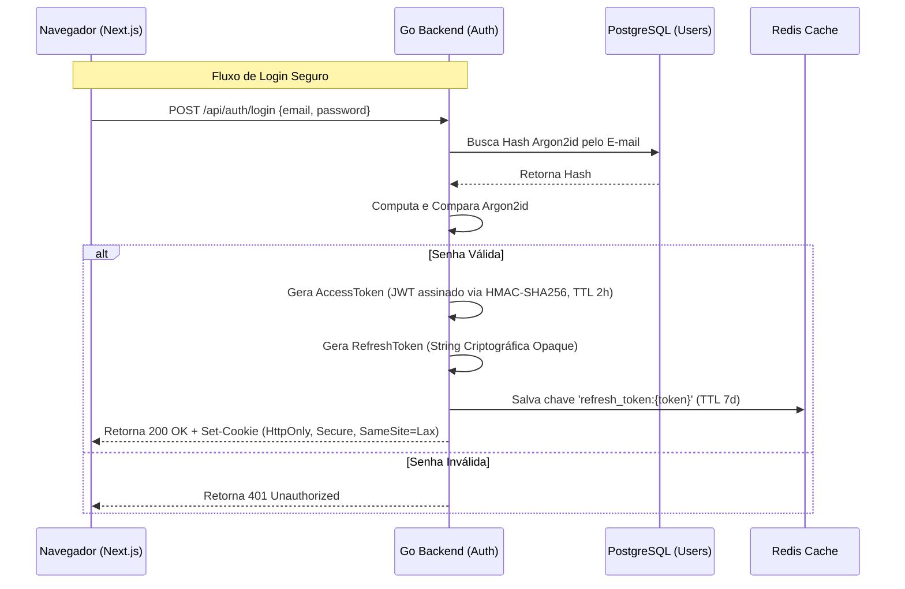
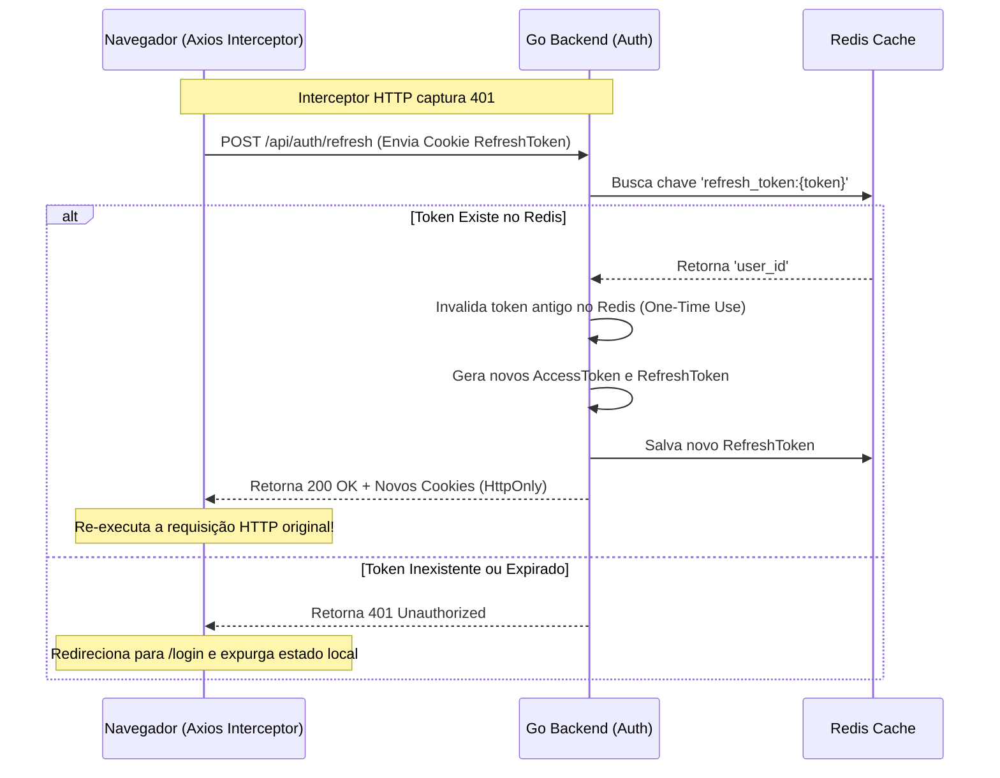

# 🔐 Autenticação e Segurança (Auth)

O módulo de Autenticação do **stock-pulse** foi projetado para oferecer segurança de nível bancário contra as principais vulnerabilidades da web (como XSS e CSRF), mantendo uma experiência de login fluida com Refresh Tokens contínuos.

## Arquitetura de Criptografia

Diferente de sistemas legados que utilizam `bcrypt` ou `SHA-256`, o Stock Pulse utiliza **Argon2id**, o vencedor do *Password Hashing Competition*, parametrizado com as recomendações estritas da OWASP (64MB de memória, paralelismo = 4). Isso garante extrema resistência estrutural contra ataques de força bruta realizados por GPUs modernas.

## Fluxo de Sessão (JWT & HttpOnly)

O uso de `localStorage` para salvar tokens JWT em aplicações React/Next.js abre enormes brechas para roubos via Cross-Site Scripting (XSS). Para blindar a plataforma, **a aplicação frontend nunca tem acesso ao token JWT no JavaScript**.

A emissão e o consumo de tokens são geridos de forma estrita pelo backend através de Cookies `HttpOnly`.

### O Sistema de Dual-Token (Access e Refresh)

1. **Access Token (JWT):** Emitido com um "Tempo de Vida" (TTL) extremamente curto (2 horas). Se um atacante interceptar a requisição (mesmo com SSL), o token perde a validade muito rápido. O payload contém apenas a identificação primária (`user_id`).
2. **Refresh Token (Opaque):** Um token gerado aleatoriamente (`crypto/rand`) com 32 bytes de entropia e salvo no **Redis** associado ao ID do usuário, durando 7 dias.

### Renovação de Sessão (Silent Refresh)

O Next.js intercepta automaticamente qualquer erro `401 Unauthorized` retornado pela API e dispara, em background, a tentativa de renovação:

Esse ciclo de **One-Time Use Refresh Tokens** (Rotação de Token) atua como um sistema de detecção de invasão. Se o usuário original e o hacker tentarem usar o mesmo Refresh Token para renovar a sessão, um deles falhará e a sessão inteira será instantaneamente revogada.
