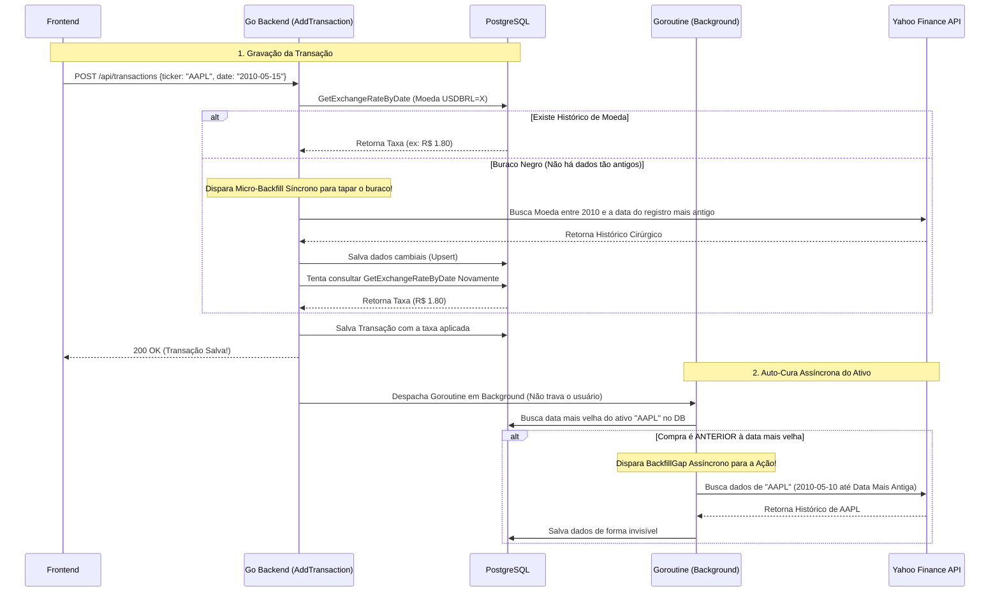

# 🚑 Portfólio e Auto-Cura Sistêmica (BackfillGap)

Para exibir um Gráfico de Patrimônio preciso e calcular a rentabilidade (como a cotação média de aquisição vs. preço atual), o **stock-pulse** depende fundamentalmente de ter o histórico diário contínuo no banco de dados para todos os ativos e pares de moeda estrangeira (ex: `USDBRL=X`).

No entanto, ativos operados na bolsa sofrem pausas (finais de semana, feriados). Além disso, usuários frequentemente importam ou registram compras retroativas de 10 ou 15 anos atrás. Em vez de entupir o banco de dados baixando 50 anos de histórico toda vez que um ativo é incluído, o sistema utiliza uma rotina cirúrgica assíncrona batizada internamente de **BackfillGap** (Auto-Cura).

## 1. O Problema da Sincronia em Transações Internacionais

Quando você compra um ativo nos EUA, a transação necessita **impreterivelmente** saber quanto o Dólar valia naquele dia exato para cravar o seu custo original na moeda da sua carteira (ex: BRL). 

Se o sistema dependesse de pedir essa informação online ao Yahoo Finance *durante* o clique do botão "Salvar", uma simples falha de rede impediria o registro da transação.

## 2. Solução: Banco de Dados como "Single Source of Truth" + LOCF

Para contornar o problema, o salvamento da transação exige apenas uma rápida consulta interna no PostgreSQL. O backend utiliza a abordagem analítica **LOCF** (*Last Observation Carried Forward*).

Se não houver cotação cambial exata naquele dia no banco de dados, o SQL busca automaticamente o valor comercial válido do **dia útil imediatamente anterior**, garantindo extrema performance (milissegundos) e tolerância a falhas na API externa.

`SELECT close_price FROM asset_daily_price WHERE asset_id = $1 AND price_date <= $2 ORDER BY price_date DESC LIMIT 1`

## 3. A Lógica da Auto-Cura (BackfillGap)

Mas o que ocorre se a compra inserida for tão antiga que **não há** dados no banco para realizar o LOCF? É aí que o mecanismo cirúrgico do **BackfillGap** brilha.

### O Desempenho do Recorte (Period1 e Period2)

O **BackfillGap** jamais baixa os 10 ou 20 anos inteiros do ativo de uma vez. O motor consulta dinamicamente `SELECT MIN(price_date)`. 
Se a transação recém salva é do dia `15/05/2010`, e o banco de dados tem registros apenas de `01/01/2016` até a data atual, a engine solicitará ao provedor financeiro **apenas** a janela específica do buraco negro (`10/05/2010` até `01/01/2016`). O que já está no banco não é rebaixado, poupando uma imensa carga de tráfego (Bandwidth) e blindando a aplicação contra os limites draconianos (Rate Limits) impostos por APIs gratuitas.
