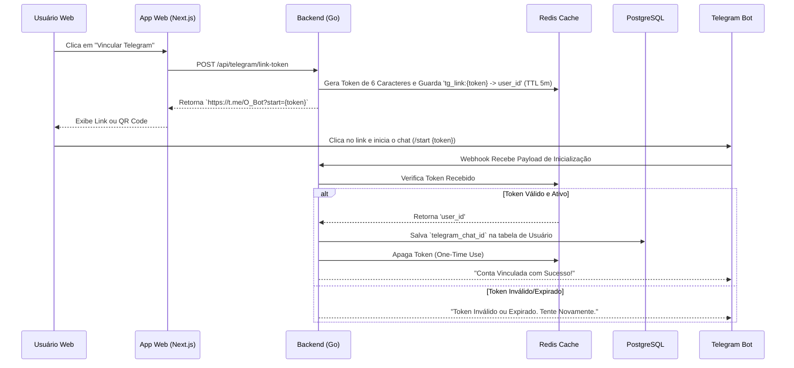
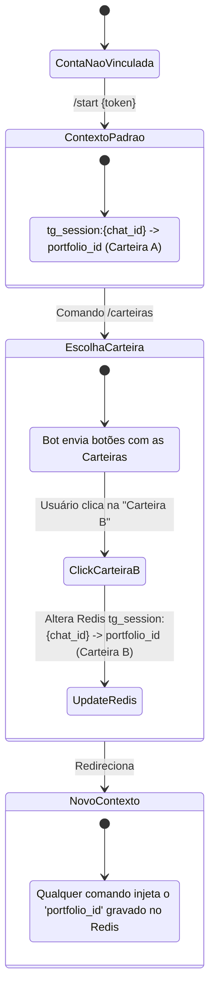

# 🤖 Integração com Telegram Bot

O módulo do Telegram do **stock-pulse** não é um mero notificador passivo; ele funciona como um terminal bidirecional onde o usuário pode operar suas carteiras nativamente. 

Como o bot interage publicamente na rede do Telegram, qualquer pessoa no mundo poderia conversar com ele. A segurança do sistema repousa em um processo de *Binding* seguro e em um controle de estado baseado em Redis.

## Fluxo de Autenticação Cruzada (Binding)

Para que a conta do Telegram (`chat_id`) do usuário seja vinculada com a conta Web da aplicação (`user_id`), nós construímos um processo de emparelhamento por Token Temporário (Pin Code ou Link Seguro).

## Gerenciamento de Estado de Sessão Multi-Carteira

Um usuário corporativo ou experiente pode ter múltiplas carteiras (ex: *Principal*, *Dividendos*, *Exterior*, *Cripto*). O Telegram Bot permite trocar de contexto a qualquer momento. Mas como a requisição do Telegram não usa "Cookies", como o bot sabe em qual carteira você está executando um comando (ex: `/resumo` ou `/dividendos`)?

Utilizamos o **Redis** para reter o "State" do Bot:

O Redis permite essa troca veloz e persistente. Cada mensagem que o bot recebe dispara um "Intercepetor (Middleware)" que puxa a sessão do Redis, identifica silenciosamente qual ID de carteira pertence àquele chat, e roteia a lógica bancária exata em milissegundos.
