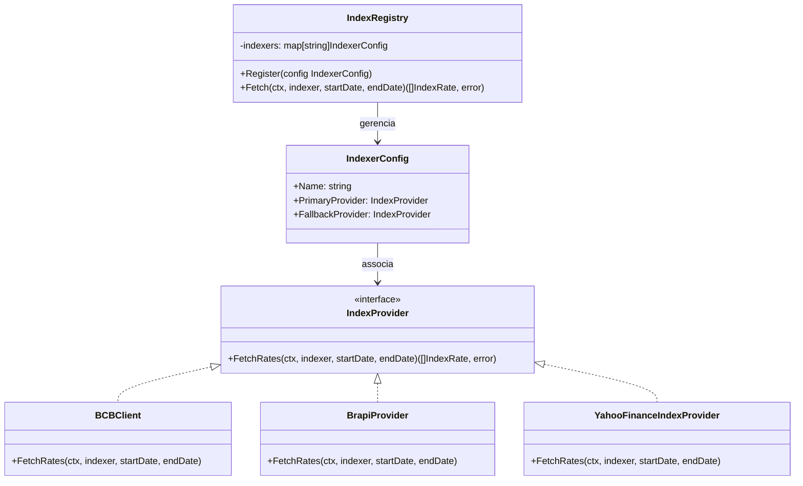

# Documentação de Arquitetura: Benchmarks e Rentabilidade

Esta documentação descreve o design de engenharia, a arquitetura e as formulações matemáticas adotadas para a sincronização, persistência e cálculo dos benchmarks no Stock Pulse.

---

## 1. Arquitetura de Provedores (Gateway Pattern & Strategy)

Para isolar a origem dos dados de mercado da lógica de negócio e persistência, o módulo `fixedincome` implementa um padrão de **Estratégia Dinâmica (IndexRegistry)**.



### Provedores e Regras de Fallback:
1. **CDI / SELIC / IPCA:** Provedor oficial é o `BCBSGSProvider` (SGS do Banco Central). Não possui fallback.
2. **IFIX e Ibovespa (IBOV):** Provedor primário é a `BrapiProvider`. Se a requisição for para um período superior a 3 meses (limitação da conta gratuita) ou se a chamada falhar, o `IndexRegistry` aciona automaticamente o fallback `YahooFinanceIndexProvider` (usando os tickers `IFIX.SA` e `^BVSP`).
3. **S&P 500 (SP500):** Provedor oficial é o `YahooFinanceIndexProvider` (ticker `^GSPC`).

---

## 2. Metodologias Matemáticas de Cálculo

Todos os cálculos de rentabilidade no gráfico de comparação começam em **0.0%** no primeiro ponto da janela de tempo filtrada ($t_0$).

### A. Rentabilidade da Carteira (TWRR - Time-Weighted Rate of Return)
Para comparar a carteira com benchmarks passivos de forma justa, expurgamos o impacto dos aportes e retiradas efetuados pelo usuário usando a fórmula TWRR.

1. Para cada dia $t$, calculamos o fluxo de caixa líquido diário externo ($C_t$):
   $$C_t = \sum \text{Valor}(\text{BUY}_t) - \sum \text{Valor}(\text{SELL}_t)$$
2. O retorno diário isolado de fluxo de caixa ($R_t$) é calculado por:
   $$R_t = \frac{V_t - C_t - V_{t-1}}{V_{t-1}}$$
   *(Se $V_{t-1} \le 10^{-6}$, $R_t = 0.0$)*
3. A rentabilidade acumulada TWRR até o dia $t$ é dada por:
   $$\text{TWRR}(t) = \left[ \prod_{d = t_0 + 1}^{t} (1 + R_d) \right] - 1$$

---

### B. Benchmark: CDI
O CDI acumula apenas em dias úteis.
1. Para cada dia útil $d$, obtemos a taxa diária de CDI ($\text{Rate}_d$) no banco de dados. Para fins de semana, $\text{Rate}_d = 0.0$.
2. O fator de acúmulo diário é:
   $$\text{Factor}_d = 1 + \frac{\text{Rate}_d}{100}$$
3. O retorno acumulado do CDI até o dia $t$ é:
   $$\text{Return}_{\text{CDI}}(t) = \left( \prod_{d = t_0 + 1}^{t} \text{Factor}_d - 1 \right) \times 100$$

---

### C. Benchmark: IPCA (Inflação)
O IPCA é divulgado mensalmente. Para apresentar uma linha de crescimento contínua (sem degraus abruptos), adotamos o **modelo pro-rata diário por dias úteis**.
1. Identificamos a taxa IPCA do mês analisado ($r_{\text{monthly}}$). Caso o mês atual não tenha IPCA publicado, usamos o último IPCA oficial conhecido.
2. Contamos o número de dias úteis (segunda a sexta) no mês em questão ($N_{\text{bus}}$).
3. Para cada dia útil $d$, o fator diário de inflação é:
   $$\text{DailyFactor}_d = \left( 1 + \frac{r_{\text{monthly}}}{100} \right)^{\frac{1}{N_{\text{bus}}}}$$
   *(Para finais de semana e feriados, $\text{DailyFactor}_d = 1.0$)*
4. O retorno acumulado do IPCA até o dia $t$ é:
   $$\text{Return}_{\text{IPCA}}(t) = \left( \prod_{d = t_0 + 1}^{t} \text{DailyFactor}_d - 1 \right) \times 100$$

---

### D. Benchmark: S&P 500 (Ajuste Cambial para Carteiras em BRL)
Se a carteira do usuário for baseada em Reais (BRL), o retorno nominal em dólar do S&P 500 sofrerá distorções cambiais. Por isso, ajustamos o benchmark pelo dólar diário (LOCF):
1. O valor de fechamento convertido em reais em qualquer dia $t$ é:
   $$I_{\text{SP500, BRL}}(t) = I_{\text{SP500}}(t) \times \text{USDBRL}(t)$$
2. O retorno acumulado ajustado até o dia $t$ é:
   $$\text{Return}_{\text{SP500}}(t) = \left( \frac{I_{\text{SP500, BRL}}(t)}{I_{\text{SP500, BRL}}(t_0)} - 1 \right) \times 100$$
   *(Se a carteira do usuário for em USD, não se aplica o multiplicador cambial).*

---

### E. Benchmarks: IFIX e Ibovespa (IBOV)
Para os índices de renda variável nacionais, calculamos o ganho percentual simples dos pontos de fechamento diários (LOCF) em relação ao dia inicial do gráfico:
$$\text{Return}_{\text{Index}}(t) = \left( \frac{I_{\text{Index}}(t)}{I_{\text{Index}}(t_0)} - 1 \right) \times 100$$

---

## 3. Adicionando Novos Provedores ou Índices

Para adicionar um novo indicador (ex: `IGPM`):
1. Crie uma classe/struct que implemente a interface `IndexProvider` em `fixedincome`.
2. Adicione o novo indicador no setup declarativo no arquivo `cmd/api/main.go`:
   ```go
   indexRegistry.Register(fixedincome.IndexerConfig{
       Name:            "IGPM",
       PrimaryProvider: seuNovoProvedor,
   })
   ```
3. Registre o nome do indicador na lista de sincronização do `fixedincome.Worker` no arquivo `worker.go`.
