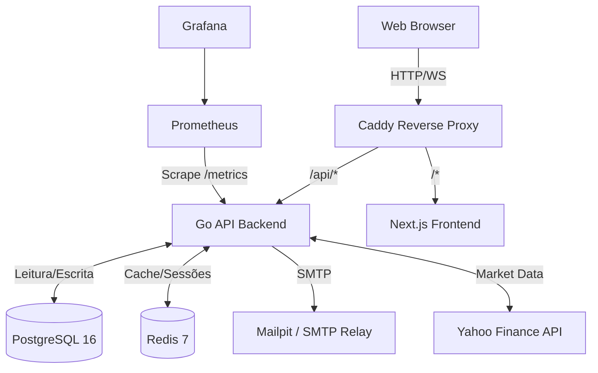

# Software Design Document (SDD) - StockPulse

## 1. Introdução
O **StockPulse** é uma plataforma moderna voltada para investidores que desejam acompanhar portfólios, criar listas de ativos favoritos (watchlists) e receber notificações automáticas sobre o mercado (alertas). O sistema foi arquitetado visando escalabilidade, observabilidade e baixa latência na entrega de cotações em tempo real.

## 2. Visão Geral da Arquitetura
O sistema adota uma arquitetura conteinerizada em **Docker**, orquestrando múltiplos serviços interdependentes através do `docker-compose`. 

A comunicação externa é centralizada por um Proxy Reverso (**Caddy**), que roteia as requisições para o Frontend (SSR/Client) ou Backend (API REST/WebSockets), atuando também como terminador TLS genérico em ambientes produtivos.

## 3. Componentes do Sistema

### 3.1. Frontend (Next.js 14)
- **Framework:** React 18 usando TypeScript e App Router.
- **Renderização:** Híbrida (SSR para SEO/Performance inicial e Client-Side para dashboards interativos).
- **Estilização:** CSS Vanilla com variáveis injetadas, adotando uma paleta _Dark Mode_ baseada em Glassmorphism.
- **Gráficos:** Renderizados via `lightweight-charts` nativamente em Canvas para performance (exibição do Portfólio).

### 3.2. Backend (Golang 1.24)
Construído sob os princípios do _Domain-Driven Design_ (DDD).
- **Roteador:** `go-chi/chi` provendo rotas RESTful ágeis e _middlewares_ injetáveis.
- **Serviços Centralizados:** 
  - `auth`: Autenticação JWT estrita com verificação de _Refresh Tokens_.
  - `portfolio` / `watchlist`: Gestão de ativos e transações.
  - `market`: Abstração de provedores externos (ex: Yahoo Finance).
  - `alert`: Workers assíncronos rodando em _Goroutines_ para checar preços continuamente.
  - `websocket`: Hub central estilo _Pub/Sub_ que envia as variações de preço para os clientes conectados.
- **Worker Pools:** Processos secundários em Go processam os Alertas em _background_ e sincronizam cotações de fechamento diário do portfólio.

### 3.3. Armazenamento e Estado
- **PostgreSQL (`pgx/v5`)**: Fonte da verdade. Relacionamentos estritos, constraints e normalização para garantir consistência financeira.
- **Redis (`go-redis`)**: Utilizado para cachear metadados de ações (diminuindo acessos ao Yahoo Finance) e gerenciamento otimizado de sessões temporárias.

## 4. Fluxos de Dados Críticos

### 4.1 Autenticação
O backend gera tokens JWT após o `/login`, mas não os devolve no corpo JSON. Eles são acoplados nativamente na resposta via **Cookies `HttpOnly`**. Isso protege a aplicação contra roubo de tokens via XSS. O Frontend não "conhece" o token, apenas envia credenciais (_include_) para domínios autorizados pelo CORS.

### 4.2 Cotações em Tempo Real
1. O usuário entra no *Dashboard* e o React abre uma conexão WebSocket (`/ws`).
2. O Backend registra a conexão em um `Hub` global.
3. O Backend envia uma mensagem `subscribe` para o Ticker X.
4. Periodicamente (ou via gatilho do Redis), o `WritePump` distribui as novidades daquele *Ticker* apenas aos clientes que o assinaram, economizando banda extrema da rede.

## 5. Segurança e Boas Práticas
- **Hashing de Senhas:** `bcrypt` com custo moderado.
- **Graceful Shutdown:** Quando o contêiner Go recebe o sinal SIGTERM (ex: ao rodar `docker down`), ele para de aceitar novos requests, aguarda as Goroutines ativas terminarem, fecha os pools de Postgres/Redis e finaliza a aplicação graciosamente, impedindo corrupção de dados.
- **CORS Estrito:** Configurado diretamente no *chi middleware* proibindo origens desabilitadas.

## 6. Observabilidade
- O middleware captura latência, status code e *throughput* via métricas do PromAuto.
- **Prometheus** coleta os dados diretamente da rota `/metrics`.
- **Grafana** consome o Prometheus para exibir painéis operacionais (`Red` methods, RED metrics).
- Logs estruturados no console fluem diretamente para o **Promtail/Loki** em um ambiente completo.
