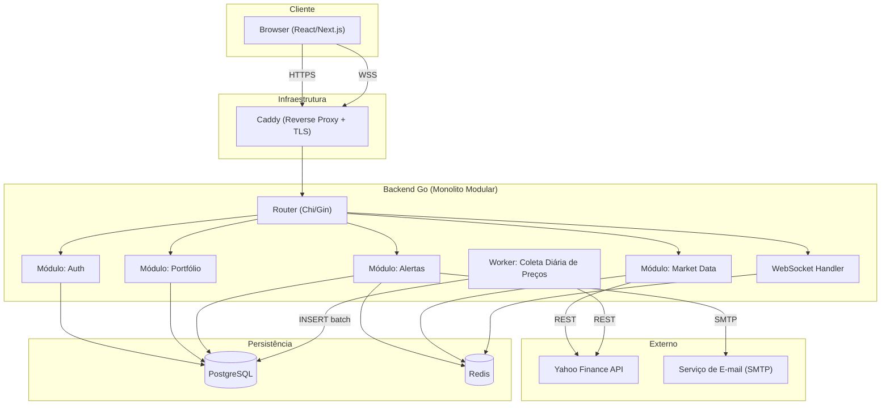
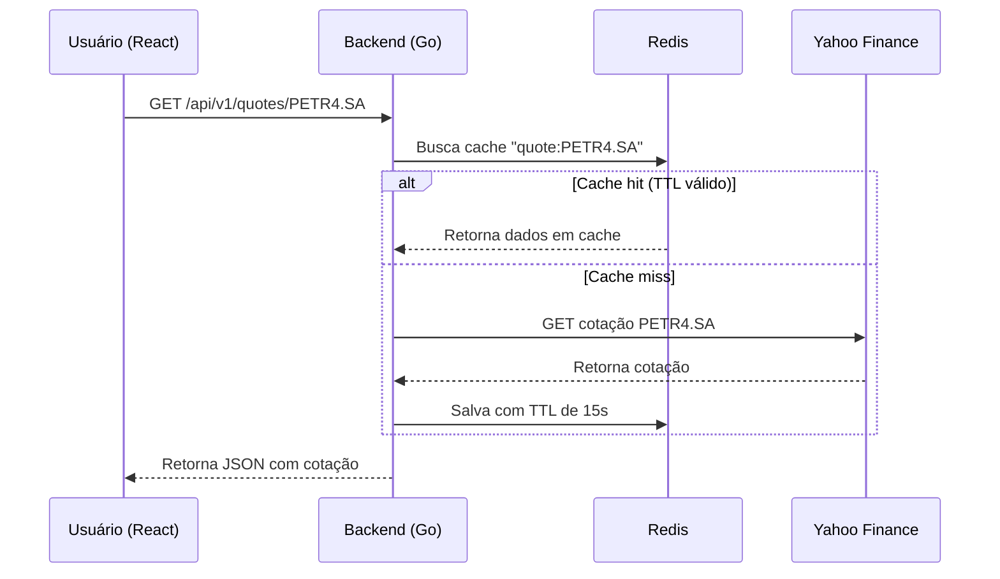
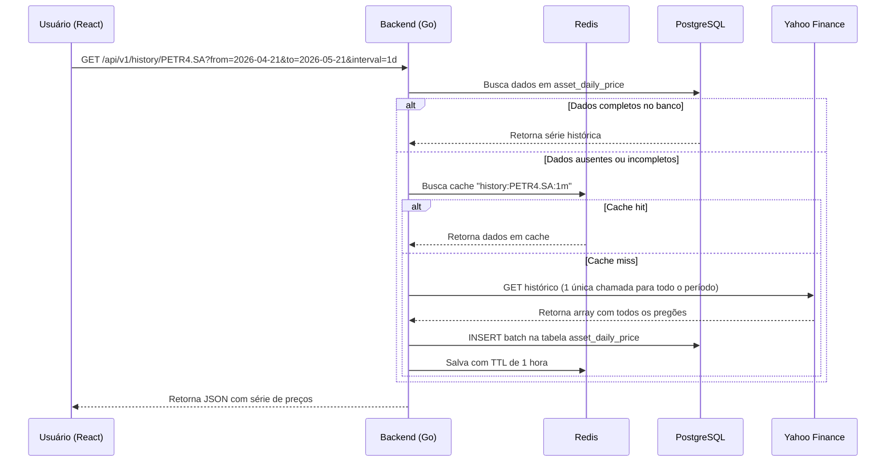
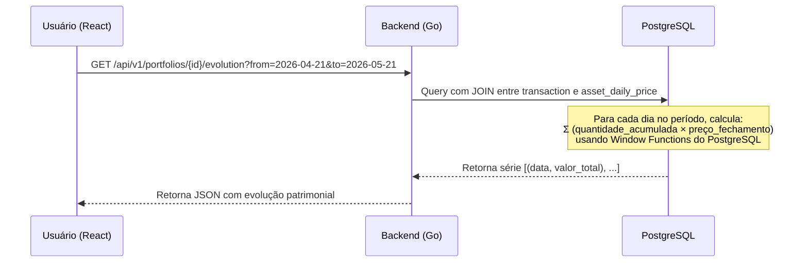
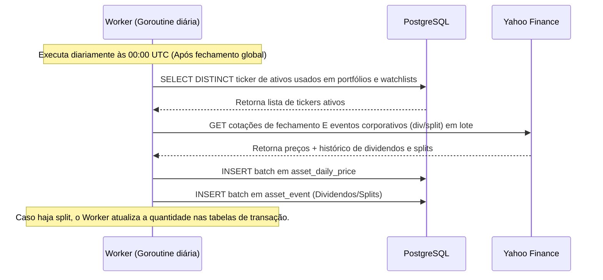
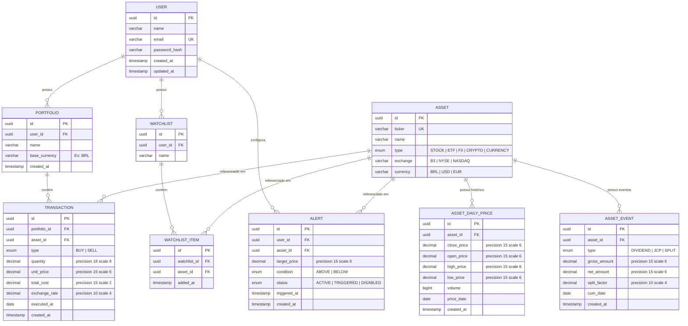
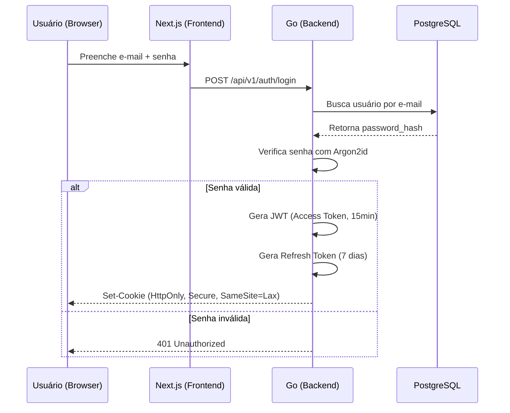

# Software Design Document (SDD) - stock-pulse: Sistema de Monitoramento de Ações

| Campo             | Valor                                  |
|-------------------|----------------------------------------|
| **Versão**        | 2.8                                    |
| **Data**          | 2026-05-21                             |
| **Status**        | Em Revisão                             |
| **Autor**         | Equipe de Desenvolvimento              |

---

## Sumário

1. [Introdução](#1-introdução)
2. [Glossário](#2-glossário)
3. [Requisitos do Sistema](#3-requisitos-do-sistema)
4. [Arquitetura do Sistema](#4-arquitetura-do-sistema)
5. [Alternativas Arquiteturais Avaliadas](#5-alternativas-arquiteturais-avaliadas)
6. [Modelagem de Dados](#6-modelagem-de-dados)
7. [Segurança](#7-segurança)
8. [Observabilidade e Monitoramento](#8-observabilidade-e-monitoramento)
9. [Estratégia de Testes](#9-estratégia-de-testes)
10. [Roadmap de Desenvolvimento](#10-roadmap-de-desenvolvimento)
11. [Riscos e Mitigações](#11-riscos-e-mitigações)
12. [Histórico de Revisões](#12-histórico-de-revisões)

---

## 1. Introdução

### 1.1 Propósito
Este documento define a arquitetura, o design técnico e as decisões de engenharia para o **stock-pulse** — uma aplicação web de monitoramento de papéis e ações nacionais (B3) e internacionais (NYSE, NASDAQ e outras). O objetivo é fornecer aos usuários uma plataforma para acompanhar cotações, gerenciar portfólios pessoais, visualizar gráficos históricos e receber alertas de variação de preço.

### 1.2 Escopo
O escopo inicial (MVP) contempla:
- Busca e visualização de cotações (com atraso de até 15 minutos, conforme limitação do provedor gratuito).
- Cotações históricas (diárias, semanais, mensais) para ações e moedas.
- Gestão de portfólio pessoal simples (compra, venda, preço médio).
- Gráficos interativos de desempenho histórico.
- Sistema básico de alertas de preço (e-mail).

### 1.3 Público-Alvo
Investidores pessoa física (iniciantes e intermediários) que desejam uma ferramenta centralizada para acompanhar ativos de renda variável do Brasil e do exterior, além de cotações de moedas estrangeiras.

### 1.4 Fora do Escopo (MVP)
- Execução de ordens de compra/venda em corretoras (integração com brokers).
- Análise fundamentalista automatizada (P/L, ROE, etc.).
- Aplicativo mobile nativo (iOS/Android) — o design será responsivo para cobrir o uso mobile via navegador.
- Chat ou fórum entre usuários.

---

## 2. Glossário

| Termo         | Definição                                                                                       |
|---------------|-------------------------------------------------------------------------------------------------|
| **Ticker**    | Código alfanumérico que identifica um ativo em uma bolsa (ex: `PETR4`, `AAPL`).                 |
| **Watchlist** | Lista personalizada de ativos que o usuário deseja acompanhar.                                  |
| **B3**        | Brasil, Bolsa, Balcão — a bolsa de valores oficial do Brasil.                                   |
| **MVP**       | Minimum Viable Product — versão mínima funcional do produto.                                    |
| **JWT**       | JSON Web Token — padrão aberto para criação de tokens de acesso.                                |
| **WebSocket** | Protocolo de comunicação bidirecional e persistente entre cliente e servidor.                    |
| **CSP**       | Content Security Policy — cabeçalho HTTP que controla quais recursos o navegador pode carregar. |
| **SSR**       | Server-Side Rendering — renderização de páginas no servidor antes de enviar ao navegador.       |

---

## 3. Requisitos do Sistema

### 3.1 Requisitos Funcionais (RF)

| ID     | Requisito                                                                                              | Prioridade |
|--------|--------------------------------------------------------------------------------------------------------|------------|
| RF01   | O sistema deve permitir o cadastro e autenticação de usuários (e-mail/senha).                          | Alta       |
| RF02   | O usuário deve ser capaz de buscar ativos por ticker ou nome da empresa.                               | Alta       |
| RF03   | O sistema deve exibir preço atual, variação (%), variação (R$), volume, máxima e mínima do dia.        | Alta       |
| RF04   | O usuário deve poder criar, editar e excluir Watchlists personalizadas.                                | Alta       |
| RF05   | O usuário deve poder criar múltiplos portfólios e registrar transações de compra e venda.              | Alta       |
| RF06   | O sistema deve calcular automaticamente preço médio, lucro/prejuízo e rentabilidade (%) do portfólio.  | Média      |
| RF07   | O sistema deve fornecer gráficos interativos de histórico de preços (1D, 1S, 1M, 6M, 1A, 5A, Máx).   | Alta       |
| RF08   | O usuário deve poder consultar cotações históricas de moedas estrangeiras (ex: USD/BRL, EUR/USD).      | Média      |
| RF09   | O usuário deve poder configurar alertas de preço com condições (acima de / abaixo de).                 | Média      |
| RF10   | O sistema deve enviar notificações por e-mail quando um alerta for acionado.                           | Média      |
| RF11   | O sistema deve permitir a troca de tema (Dark Mode / Light Mode).                                      | Baixa      |

### 3.2 Requisitos Não Funcionais (RNF)

| ID     | Categoria         | Requisito                                                                                                                                                      |
|--------|-------------------|----------------------------------------------------------------------------------------------------------------------------------------------------------------|
| RNF01  | Desempenho        | A atualização de cotações nas Watchlists deve ocorrer em no máximo 5 segundos. O tempo de resposta da API para endpoints não-financeiros deve ser < 200ms.     |
| RNF02  | Escalabilidade    | O sistema deve suportar pelo menos 1.000 usuários simultâneos e lidar com picos durante abertura/fechamento de mercados sem degradação perceptível.            |
| RNF03  | Segurança (Back)  | Senhas armazenadas com Argon2id. Comunicação exclusivamente via HTTPS/TLS 1.3. Autenticação via JWT armazenado em Cookies HttpOnly + Secure + SameSite=Lax.   |
| RNF04  | Segurança (Front) | Content Security Policy (CSP) para mitigar XSS. Sanitização de inputs com Zod. Proteção de rotas (Route Guards) no Next.js Middleware.                        |
| RNF05  | Disponibilidade   | O sistema deve buscar um uptime de 99.5% (meta realista para MVP com infraestrutura enxuta).                                                                  |
| RNF06  | Observabilidade   | Logs estruturados (JSON) no backend. Métricas de latência e taxa de erro expostas. Health check endpoint (`/healthz`).                                        |
| RNF07  | Responsividade    | A interface deve ser 100% funcional em resoluções de 320px (mobile) a 2560px (ultrawide), sem quebra de layout.                                                |
| RNF08  | Paginação         | Endpoints de listagem pesada (ex: transações de portfólio, histórico de preços) devem implementar paginação (Offset/Limit ou Cursor Pagination) na API.          |
| RNF09  | Resiliência       | Desligamento Seguro (Graceful Shutdown) obrigatório no Go. Interceptar `SIGTERM` e aguardar o processamento de HTTP requests e Goroutines ativas antes do encerramento. |

---

## 4. Arquitetura do Sistema

### 4.1 Visão Geral
A aplicação segue a arquitetura de **Monolito Modular** no backend, onde todos os domínios (autenticação, portfólio, dados de mercado, alertas) residem no mesmo binário Go, mas organizados em pacotes independentes com fronteiras claras. Essa escolha prioriza simplicidade operacional no MVP, sem impedir a extração futura de microsserviços.

O frontend é uma aplicação **Next.js (React)** com SSR para SEO e carregamento rápido, servida separadamente e consumindo a API REST do backend. Comunicação em tempo real será feita via **WebSockets**.

### 4.2 Stack Tecnológico

| Camada                | Tecnologia                    | Justificativa                                                                                         |
|-----------------------|-------------------------------|-------------------------------------------------------------------------------------------------------|
| **Frontend**          | React + Next.js               | SSR/SSG restrito apenas a páginas públicas (Landing Pages para SEO). O Dashboard logado usará CSR (Client-Side Rendering) para máxima fluidez e redução de custo computacional no servidor. |
| **Estilização**       | CSS Modules + CSS moderno     | Flexbox, Grid, Media Queries, variáveis CSS. Design premium com Dark Mode e Glassmorphism.            |
| **Gráficos**          | Lightweight Charts (TradingView) | Biblioteca open-source do TradingView, otimizada para dados financeiros com candlesticks e volumes.   |
| **Backend**           | Go (Golang)                   | Alta performance, concorrência nativa (Goroutines), binário único, excelente para WebSockets.         |
| **Roteador HTTP**     | Chi ou Gin                    | Roteadores leves e idiomáticos para Go, com suporte a middlewares.                                    |
| **Banco Relacional**  | PostgreSQL                    | Tipos numéricos precisos (NUMERIC), Window Functions para cálculos financeiros, JSONB, LISTEN/NOTIFY. |
| **Driver SQL (Go)**   | pgx                           | Driver nativo de alta performance para PostgreSQL em Go, com suporte a tipos avançados.               |
| **Migrações de Banco**| golang-migrate                | Versionamento de schemas SQL executado via CLI no CI/CD, garantindo reprodutibilidade das tabelas.    |
| **Cache**             | Redis                         | Cache de cotações (TTL curto), filas de tarefas (alertas), Pub/Sub para distribuição de eventos.      |
| **Provedor de Dados** | Yahoo Finance API (não-oficial) | Gratuito, cobre ações globais + B3 (`.SA`) + moedas (`USDBRL=X`) + **histórico completo de cotações**. |
| **Reverse Proxy**     | Caddy ou Nginx                | Terminação TLS/HTTPS automática, proxy reverso para o binário Go.                                    |
| **Containerização**   | Docker + Docker Compose       | Padronização de ambientes (dev, staging, prod).                                                       |
| **CI/CD**             | GitHub Actions                | Pipeline automatizado de build, testes e deploy.                                                      |
| **Hospedagem**        | VPS (ex: Hetzner, DigitalOcean) ou AWS EC2 | Custo acessível para MVP. Frontend pode ser servido via Vercel gratuitamente.                       |

### 4.3 Diagrama de Arquitetura



### 4.4 Fluxo de Dados: Consulta de Cotação em Tempo Real



### 4.5 Fluxo de Dados: Gráfico Histórico de um Ativo

Para exibir a evolução de preço de um ativo ao longo de 1 mês (ou qualquer período), o sistema faz **uma única chamada** à Yahoo Finance API, que retorna todos os pregões do período em um único JSON. O resultado é cacheado no Redis.



### 4.6 Fluxo de Dados: Evolução do Patrimônio de uma Carteira

A evolução do patrimônio é calculada sob demanda a partir de duas fontes que já existem no banco: a tabela `asset_daily_price` (preços históricos por ticker) e a tabela `transaction` (compras e vendas do usuário). **Nenhuma chamada à API externa é necessária.**



A query SQL utilizada pelo backend:

```sql
SELECT
    adp.price_date,
    SUM(pos.quantity * adp.close_price) AS total_value
FROM asset_daily_price adp
INNER JOIN (
    SELECT
        t.asset_id,
        SUM(CASE WHEN t.type = 'BUY' THEN t.quantity ELSE -t.quantity END) AS quantity
    FROM transaction t
    WHERE t.portfolio_id = $1
      AND t.executed_at <= adp.price_date
    GROUP BY t.asset_id
    HAVING SUM(CASE WHEN t.type = 'BUY' THEN t.quantity ELSE -t.quantity END) > 0
) pos ON pos.asset_id = adp.asset_id
WHERE adp.price_date BETWEEN $2 AND $3
GROUP BY adp.price_date
ORDER BY adp.price_date;
```

> [!TIP]
> Esta abordagem de **snapshot por ticker** (e não por portfólio) significa que os preços são armazenados **uma única vez por ativo por dia**, independente de quantos usuários possuem aquele ativo. Isso elimina duplicação de dados, reduz drasticamente o espaço em disco e permite funcionalidades extras como comparação entre ativos e rankings de performance.

### 4.6.1 Regra de Negócio: Cálculo do Preço Médio
O sistema calculará o preço médio de aquisição seguindo a norma do mercado financeiro (Média Ponderada):
- Apenas operações de **COMPRA (BUY)** recalculam o preço médio.
- Operações de **VENDA (SELL)** não alteram o preço médio, apenas reduzem a quantidade em custódia e geram Lucro/Prejuízo Realizado.
- Se a quantidade em custódia chegar a zero, o preço médio é "resetado" e a próxima compra definirá o novo valor base.

### 4.6.2 Regra de Negócio: Proventos Brutos vs Líquidos (Impostos)
A API do Yahoo Finance informa os dividendos em seu valor bruto. Para refletir a realidade financeira:
- A tabela `ASSET_EVENT` armazenará o valor original em `gross_amount`.
- O Go possuirá uma Calculadora de Impostos que determinará o `net_amount` (Líquido) antes de salvar no banco:
  - **Ações EUA (Dividends):** Retenção de 30% na fonte.
  - **Ações BR (JCP):** Retenção de 15% na fonte.
  - **Ações BR / FIIs (Dividendos regulares):** Isentos (Net = Gross).
- O Frontend permitirá ao usuário alternar a visualização da rentabilidade entre Bruta e Líquida.

### 4.7 Worker Diário: Coleta de Preços e Câmbio (Forex)

Uma **Goroutine agendada** é executada diariamente após o fechamento dos mercados para garantir que a tabela `asset_daily_price` esteja sempre atualizada.

**Cálculo de Patrimônio Internacional:** Para garantir a precisão do portfólio em tempo real, o Worker não busca apenas ações, mas também os pares de moedas (ex: `USDBRL=X`) necessários para converter o preço atual do ativo estrangeiro para a `base_currency` da carteira do usuário. O valor do `exchange_rate` na tabela `TRANSACTION` fica congelado para registrar o "Custo de Aquisição", mas o valor *atual* da carteira flutuará conforme a cotação cambial do dia.

**Fluxo do Worker:**


**Regras do Worker:**
- Executa às **00:00 UTC** garantindo que as bolsas globais (B3, NYSE, NASDAQ) já realizaram seus fechamentos.
- Busca o parâmetro `?events=div,split` na API do Yahoo Finance para identificar pagamentos de proventos e agrupamentos/desdobramentos.
- Em caso de falha em um ticker específico, loga o erro e continua com os demais (resiliência parcial).
- Na primeira execução para um ativo novo, faz o backfill de histórico (últimos 5 anos) para popular os gráficos imediatamente.

### 4.8 Worker de Alertas Intradiário (AlertWorker)

Para garantir que os alertas de preço funcionem mesmo com o usuário offline (sem requisições HTTP ativas), uma segunda Goroutine será executada a cada 5 minutos (apenas durante o horário de pregão das bolsas).

**Regras do AlertWorker:**
1. O worker consulta o banco de dados buscando a lista única (`DISTINCT`) de todos os tickers que possuem alertas com status `ACTIVE`.
2. Faz uma requisição em lote (Batch) à Yahoo API buscando o preço atual em tempo real.
3. Se o preço cruzar o `target_price` da regra estabelecida pelo usuário, o status do alerta muda para `TRIGGERED`.
4. O worker publica um evento na fila do Redis para que o serviço de mensageria dispare o e-mail (SMTP) de forma assíncrona, evitando gargalos no loop de verificação de preços.

### 4.9 Estratégia de Fallback para Provedor de Dados

> [!WARNING]
> A API do Yahoo Finance é **não-oficial**. Pode sofrer alterações sem aviso prévio ou ser bloqueada temporariamente.

**Plano de contingência:**
1. O módulo `MarketData` no Go será construído com uma **interface (contrato)** que abstrai o provedor.
2. Implementaremos inicialmente o `YahooProvider`, mas a arquitetura permitirá conectar um `AlphaVantageProvider` ou `BRAPIProvider` apenas trocando a implementação, sem alterar nenhum outro código do sistema.
3. Em caso de falha do Yahoo, o sistema retornará o último valor disponível no Redis (cache stale) ou da tabela `asset_daily_price` com um indicador visual de "Dados podem estar desatualizados".
4. Como a tabela `asset_daily_price` mantém todo o histórico localmente, gráficos históricos e evolução do patrimônio continuam funcionando normalmente mesmo durante indisponibilidade do provedor externo.

```go
// Interface no Go — contrato que qualquer provedor deve seguir
type QuoteProvider interface {
    GetQuote(ctx context.Context, ticker string) (*Quote, error)
    GetHistorical(ctx context.Context, ticker string, from, to time.Time) ([]HistoricalQuote, error)
}
```

---

## 5. Alternativas Arquiteturais Avaliadas

A tabela abaixo documenta as alternativas consideradas durante o design e as razões pelas quais foram aceitas ou descartadas.

### 5.1 Backend

| Alternativa                   | Prós                                                              | Contras                                                     | Decisão       |
|-------------------------------|-------------------------------------------------------------------|-------------------------------------------------------------|---------------|
| **Go (Monolito Modular)** ✅   | Performance, concorrência nativa, binário único, deploy simples   | Ecossistema menor que Node.js para libs web                 | **Aceita**    |
| Node.js (NestJS)              | Ecossistema gigante, compartilha linguagem com frontend           | Single-threaded, maior consumo de memória                   | Descartada    |
| Python (FastAPI)              | Excelente para prototipação rápida, libs de data science          | Performance inferior para WebSockets de alta concorrência   | Descartada    |
| Microsserviços (Go)           | Escalabilidade independente por domínio                           | Complexidade operacional excessiva para MVP (DevOps pesado) | Descartada (futuro) |

### 5.2 Banco de Dados

| Alternativa               | Prós                                                                  | Contras                                                        | Decisão       |
|----------------------------|-----------------------------------------------------------------------|----------------------------------------------------------------|---------------|
| **PostgreSQL** ✅           | Window Functions, NUMERIC preciso, JSONB, LISTEN/NOTIFY, driver `pgx` | Configuração inicial ligeiramente mais complexa que MySQL      | **Aceita**    |
| MySQL                      | Muito popular, boa performance em leitura simples                     | Menos recursos analíticos nativos, sem LISTEN/NOTIFY           | Descartada    |
| MongoDB                    | Flexibilidade de schema para dados semi-estruturados                  | Desnecessário para modelo relacional claro; menos garantias ACID | Descartada  |

### 5.3 Provedor de Dados

| Alternativa                     | Prós                                                    | Contras                                                  | Decisão       |
|---------------------------------|---------------------------------------------------------|----------------------------------------------------------|---------------|
| **Yahoo Finance (não-oficial)** ✅ | Gratuito, global, B3, moedas, histórico completo       | Não-oficial, pode ser descontinuado                      | **Aceita**    |
| Alpha Vantage (free)            | Oficial, documentação excelente                         | Limite de 25 req/dia no plano grátis                     | Descartada (fallback) |
| BRAPI                           | Foco em Brasil, documentação em PT-BR                   | Não cobre mercado internacional                          | Descartada (fallback) |
| Finnhub (free)                  | 60 req/min, tempo real nos EUA                          | B3 ausente no plano grátis                               | Descartada    |
| EODHD (pago)                    | Profissional, SLA, global + BR                          | Custo (~$20/mês)                                         | Descartada (futuro) |

### 5.4 Frontend

| Alternativa                | Prós                                                    | Contras                                                    | Decisão       |
|----------------------------|---------------------------------------------------------|------------------------------------------------------------|---------------|
| **React + Next.js** ✅      | SSR/SEO, maior ecossistema, libs de gráficos financeiros | Maior bundle size, complexidade de configuração            | **Aceita**    |
| Vue + Nuxt.js              | Curva de aprendizado suave, código limpo                | Menor ecossistema de libs financeiras prontas               | Descartada    |
| Svelte + SvelteKit         | Bundle menor, muito rápido                              | Ecossistema ainda pequeno, menos componentes prontos        | Descartada    |

---

## 6. Modelagem de Dados

### 6.1 Diagrama Entidade-Relacionamento



### 6.2 Observações sobre a Modelagem
- **UUIDs como Primary Keys:** Escolhidos para evitar colisão em cenários distribuídos futuros e para não expor IDs sequenciais na API (segurança e ofuscação).
- **Timezones (Timestamptz):** Todos os campos exibidos no diagrama como `timestamp` deverão ser implementados no PostgreSQL estritamente como `TIMESTAMPTZ` (Timestamp with Time Zone), blindando o sistema contra divergências de fuso horário entre o servidor (UTC) e os usuários locais. O campo `executed_at` usa apenas `date` pois o horário exato intra-day da negociação não afeta a matemática de longo prazo do portfólio.
- **Tabela ASSET:** Funciona como um cache local dos ativos consultados. Quando um usuário busca um ticker novo, ele é persistido nessa tabela para reuso.
- **Tabela ASSET_DAILY_PRICE:** Armazena o preço de fechamento de cada ativo **uma única vez por dia**. Estratégia de **snapshot por ticker** para eliminar redundância de dados entre usuários.
- **Tabela ASSET_EVENT:** Armazena dividendos pagos e desdobramentos (splits). Fundamental para calcular o retorno total (Total Return) do portfólio de forma automática.
- **Portfólio Multi-moeda:** A tabela `PORTFOLIO` possui o campo `base_currency`. A tabela `TRANSACTION` possui o campo `exchange_rate`, permitindo que a compra de um ativo internacional seja corretamente lastreada pela cotação do câmbio do dia.
- **Validação de Ticker:** O sistema bloqueia a inserção de "lixo" no banco de dados. Um novo ticker (ex: "PETR4.SA") só é cadastrado na tabela `ASSET` caso a API do provedor retorne dados válidos na primeira busca.
- **Transações ACID:** Processamentos em massa e críticos (como o recálculo de quantidades nas carteiras devido a um evento de *Split*) devem obrigatoriamente ser encapsulados em transações do PostgreSQL (`BEGIN; ... COMMIT;`). Em caso de falha, ocorre o `ROLLBACK` total, preservando a integridade.
- **Ativos Deslistados (Lifecycle):** Caso a API do Yahoo retorne erro "Not Found" sucessivas vezes (ex: ticker mudou de FB para META, ou empresa saiu da bolsa), o campo `is_active` recebe `false`. O Worker ignora o ativo no futuro e a interface notifica o usuário sobre a obsolescência.
- **Unique Constraints (Integridade):** Para evitar "Race Conditions" e sujeira no banco, o banco utilizará Constraints Compostas `UNIQUE(user_id, name)` na tabela `PORTFOLIO`, transferindo a responsabilidade de trava lógica para o SGBD.

---

## 7. Segurança

### 7.1 Autenticação e Autorização



### 7.2 Camadas de Segurança

| Camada            | Mecanismo                                                                                      |
|-------------------|------------------------------------------------------------------------------------------------|
| **Transporte**    | HTTPS/TLS 1.3 obrigatório, gerenciado pelo Caddy (certificado automático via Let's Encrypt).   |
| **Autenticação**  | JWT em Cookie HttpOnly + Secure + SameSite=Lax. Access Token (15min) + Refresh Token (7 dias). |
| **Senhas**        | Hash com Argon2id (resistente a GPU attacks).                                                  |
| **Anti-XSS**      | React escapa conteúdo por padrão + Content Security Policy (CSP) restritiva no Next.js.       |
| **Anti-CSRF**     | Cookie SameSite=Lax impede envio cross-origin. CSRF token adicional em formulários críticos.   |
| **Validação**     | Frontend: Zod. Backend: validação e sanitização em Go antes de qualquer operação no banco.     |
| **Rate Limiting** | Middleware em Go limitando requisições por IP (ex: 100 req/min). Redis como contador.          |
| **Isolamento de Tenant (Anti-IDOR)** | Todas as consultas (SELECT) e mutações (UPDATE/DELETE) devem obrigatoriamente validar o `user_id` extraído do JWT logado, impedindo que requisições forjadas acessem portfólios ou transações de terceiros (prevenção contra Insecure Direct Object Reference). |
| **Idempotência**  | Rotas mutáveis críticas (ex: `POST /transactions`) exigirão o cabeçalho `X-Idempotency-Key` com um UUID gerado pelo frontend. O Go armazenará essa chave no Redis por 24h para descartar requisições duplicadas (prevenção de "duplo clique" ou retentativas de rede), protegendo a carteira. |
| **Route Guards**  | Next.js Middleware intercepta rotas protegidas e redireciona para `/login` se não autenticado. |
| **CORS Seguro**   | O Go será configurado com `Access-Control-Allow-Origin` apontando apenas para a URL oficial do Frontend, com `AllowCredentials=true` para autorizar os cookies JWT, bloqueando sites terceiros. |

### 7.3 Fluxo de Recuperação de Senha
- O usuário solicita a redefinição pelo Frontend informando o seu e-mail cadastrado.
- O Backend gera um token seguro, salva-o diretamente no **Redis** (com formato `pwd_reset:user_id:token` e TTL de 30 minutos, evitando poluir o PostgreSQL) e dispara o e-mail via SMTP com o link de recuperação.
- O Frontend captura o token pela URL, coleta a nova senha e envia ao Backend, que valida o token no Redis, atualiza o `password_hash` no banco e revoga o token imediatamente.

### 7.4 Privacidade e Conformidade (LGPD)
- **Exclusão de Dados (Direito ao Esquecimento):** Caso o usuário solicite a exclusão da conta, o sistema fará um **Hard Delete** (exclusão física) de todos os seus dados pessoais e financeiros (com `ON DELETE CASCADE`), após um período seguro de retenção predeterminado (ex: 30 dias na lixeira/soft-delete para evitar exclusões acidentais).
- **Minimização:** O único dado estritamente PII (Personally Identifiable Information) armazenado é o e-mail do usuário.


---

## 8. Observabilidade e Monitoramento

> [!IMPORTANT]
> A observabilidade é crítica para um sistema que depende de APIs externas e requer alta disponibilidade. O projeto utilizará a stack **LGTM (Loki, Grafana, Tempo, Metrics)**, padrão de mercado para ambientes com Go e Docker.

### 8.1 Pilares da Observabilidade

| Aspecto | Ferramenta / Abordagem |
|---------|------------------------|
| **Métricas** | **Prometheus:** Coleta métricas numéricas. O Go e o Caddy expõem endpoints `/metrics`. Serão monitorados: latência (tempo de resposta), taxa de erro (status HTTP 500, 400), quantidade de requisições, e uso de CPU/Memória (via `Node Exporter` e `cAdvisor`). |
| **Logs** | **Loki + Promtail:** Todo código Go gerará logs estruturados em formato JSON utilizando a biblioteca padrão `log/slog` (ex: `{"level":"error", "ticker":"PETR4"}`). O Promtail coletará os logs dos containers Docker e enviará ao Loki, que os indexa de forma eficiente para buscas futuras. |
| **Visualização** | **Grafana:** Painel de controle central que se conecta ao Prometheus e Loki. Oferecerá dashboards de infraestrutura (CPU/RAM), de tráfego (gráficos de pizza com status HTTP) e de negócios (tickers mais buscados). Permite pesquisar logs lado-a-lado com as métricas no menu "Explore". |
| **Alertas** | **Alertmanager:** Regras configuradas no Prometheus/Grafana para notificar (Slack, E-mail, Telegram) em casos como: CPU > 85%, API do Yahoo indisponível por > 5 min, ou pico de erros 401/500. |
| **Health Check** | Endpoint `GET /healthz` na API Go que verifica constantemente a conectividade com PostgreSQL e Redis. |

---

## 9. Estratégia de Testes

### 9.1 Pirâmide de Testes

| Nível               | Escopo                                                                                  | Ferramentas                         |
|---------------------|-----------------------------------------------------------------------------------------|-------------------------------------|
| **Unitários (Go)**  | Cálculo de preço médio, rentabilidade, lógica de acionamento de alertas, validações     | `testing` (stdlib Go) + `testify`   |
| **Unitários (React)** | Componentes de UI, formatação de moeda, lógica de estado                             | Jest + React Testing Library        |
| **Integração**      | Endpoints da API com banco de testes real (PostgreSQL em Docker), cache Redis, mocks da Yahoo Finance API | `testing` (Go) + `testcontainers-go` |
| **End-to-End**      | Jornada completa: Login → Buscar ativo → Adicionar ao portfólio → Verificar dashboard  | Playwright                          |

### 9.2 Casos de Teste Críticos
- Cálculo correto do preço médio ao adicionar múltiplas compras do mesmo ativo.
- Disparo de alerta quando o preço cruza o limiar configurado.
- Fallback para cache stale quando a Yahoo Finance API está indisponível.
- Proteção de rota: acesso não autenticado ao `/dashboard` deve redirecionar para `/login`.
- Refresh automático do JWT quando o Access Token expira.
- **Worker diário:** Coleta de preços de fechamento e inserção correta na tabela `asset_daily_price` (sem duplicações, com ON CONFLICT DO NOTHING).
- **Evolução patrimonial:** Cálculo correto do valor da carteira considerando compras e vendas em datas diferentes (posição acumulada por dia).
- **Gráfico histórico:** Retorno correto de série de preços a partir da tabela `asset_daily_price`, com fallback para Yahoo Finance quando dados estão ausentes.
- **Backfill:** Na primeira consulta de um ativo novo, o sistema deve popular o histórico de preços e servir o gráfico corretamente na mesma requisição.

---

## 10. Roadmap de Desenvolvimento

### Fase 1: Fundação e MVP (Semanas 1–4)
- [ ] Configurar repositório monorepo ou multi-repo (Go + Next.js).
- [ ] Configurar Docker Compose (PostgreSQL, Redis, Go, Next.js).
- [ ] Configurar pipeline CI/CD com GitHub Actions (lint, test, build).
- [ ] Implementar módulo de autenticação completo (registro, login, JWT, refresh).
- [ ] Implementar módulo Market Data com integração Yahoo Finance + cache Redis.
- [ ] Desenvolver tela de busca de ativos e exibição de cotação atual.
- [ ] Desenvolver tela de Watchlist.
- [ ] Implementar design responsivo (mobile-first) com Dark Mode.

### Fase 2: Portfólio, Gráficos e Histórico (Semanas 5–8)
- [ ] Criar tabela `asset_daily_price` com constraint UNIQUE e índice otimizado.
- [ ] Implementar Worker diário de coleta de preços de fechamento (Goroutine agendada).
- [ ] Implementar lógica de backfill de histórico (5 anos) para ativos novos.
- [ ] Implementar modelagem de Portfólio e Transações no PostgreSQL.
- [ ] Desenvolver API de gestão de portfólio (CRUD + cálculos financeiros).
- [ ] Desenvolver endpoint de evolução patrimonial com JOIN entre `transaction` e `asset_daily_price`.
- [ ] Desenvolver tela de portfólio com preço médio, lucro/prejuízo e rentabilidade.
- [ ] Desenvolver tela de evolução do patrimônio com gráfico de linha.
- [ ] Integrar Lightweight Charts (TradingView) para gráficos de candlestick e histórico.
- [ ] Implementar tela de cotações de moedas com histórico.

### Fase 3: Alertas e Tempo Real (Semanas 9–11)
- [ ] Implementar WebSockets para atualização de cotações em tempo real na Watchlist.
- [ ] Implementar módulo de Alertas (CRUD + worker de verificação em background).
- [ ] Configurar envio de e-mails via SMTP (ex: Resend, Mailgun ou Amazon SES).
- [ ] Implementar tela de gerenciamento de alertas no frontend.

### Fase 4: Polimento e Produção (Semanas 12–14)
- [ ] Implementar observabilidade (logs, métricas, health check).
- [ ] Testes E2E com Playwright.
- [ ] Otimização de performance (lazy loading, code splitting, compressão).
- [ ] Deploy em produção (VPS + Caddy + Docker).
- [ ] Documentação de API (Swagger/OpenAPI).

---

## 11. Riscos e Mitigações

| Risco                                             | Probabilidade | Impacto | Mitigação                                                                                  |
|---------------------------------------------------|---------------|---------|--------------------------------------------------------------------------------------------|
| Yahoo Finance API ser descontinuada ou bloqueada  | Média         | Alto    | Interface `QuoteProvider` permite troca rápida de provedor. Cache stale como fallback.     |
| Limites de requisição da API atingidos             | Alta          | Médio   | Cache agressivo no Redis (TTL de 15s). Deduplicação de requisições simultâneas ao mesmo ticker. |
| Dados financeiros incorretos do provedor          | Baixa         | Alto    | Validação de sanidade no backend (ex: preço > 0, variação < 100% em um dia).              |
| Crescimento inesperado de usuários                | Baixa         | Médio   | Monolito modular permite extrair microsserviços. Redis desacopla carga.                    |
| Vulnerabilidade de segurança (XSS, CSRF, SQLi)    | Baixa         | Alto    | Múltiplas camadas de defesa documentadas na Seção 7. Testes de segurança no CI.            |

---

## 12. Backlog de Melhorias Futuras (Fora do MVP)

| Funcionalidade | Descrição |
|----------------|-----------|
| **Revogação JWT (Blocklist)** | Implementar uma Blocklist no Redis para armazenar tokens JWT invalidados no momento do Logout, aumentando a segurança do controle de sessão. |
| **Integração B3 (CEI)** | Importação automática de notas de corretagem usando a API oficial da B3. |

---

## 13. Histórico de Revisões

| Versão | Data       | Autor   | Descrição                                                                                                                |
|--------|------------|---------|--------------------------------------------------------------------------------------------------------------------------|
| 1.0    | 2026-05-20 | Equipe  | Versão inicial do SDD com requisitos básicos, stack tecnológico e roadmap.                                               |
| 2.0    | 2026-05-20 | Equipe  | Revisão completa: correção de inconsistências (RNF duplicado), adição de Glossário, Alternativas Arquiteturais, ER Diagram detalhado, Segurança expandida, Observabilidade, Riscos e Mitigações, Fallback de API, diagramas de sequência. |
| 2.1    | 2026-05-21 | Equipe  | Adição da estratégia de snapshot por ticker (`asset_daily_price`): nova entidade no ER, Worker diário de coleta de preços, fluxos de dados para gráficos históricos e evolução patrimonial, query SQL de cálculo de patrimônio, novos casos de teste, roadmap reajustado. |
| 2.2    | 2026-05-21 | Equipe  | SDD Em Revisão. Resolvidos pontos de negócio críticos: adição de `base_currency` no portfólio para conversão cambial, criação da tabela `asset_event` para automatizar cálculo de dividendos e splits via Yahoo Finance API, e ajuste do Worker diário para 00:00 UTC garantindo fechamento global. |
| 2.3    | 2026-05-21 | Equipe  | Ajustes operacionais: Adicionado RNF de Paginação (RNF08), precisão decimal para Criptos (`18,8`), regras de LGPD (Hard delete) e criação da Seção de Melhorias Futuras (Blocklist JWT). |
| 2.4    | 2026-05-21 | Equipe  | Adicionada modelagem de Migrations, configuração rigorosa de CORS, especificação do tipo TIMESTAMPTZ e regra de negócio financeira de preço médio. |
| 2.5    | 2026-05-21 | Equipe  | Adicionadas camadas de resiliência: Worker de Alertas intradiário (offline), Idempotência para transações e Fluxo completo de Recuperação de Senha com Redis. |
| 2.6    | 2026-05-21 | Equipe  | Refinamento técnico extremo: Adicionado Client-Side Rendering (CSR) para área logada, bloqueio de tickers falsos, Isolamento de Tenant na camada de segurança (Anti-IDOR) e uso de transações ACID para atualizações críticas. |
| 2.7    | 2026-05-21 | Equipe  | Day-2 Operations: Integrado câmbio dinâmico (USDBRL), controle de ciclo de vida de ativos (deslistados via is_active), Unique Constraints no DB e Graceful Shutdown (RNF09) no backend Go. |
| 2.8    | 2026-05-21 | Equipe  | Adicionada a modelagem e regra de negócio fiscal para cálculo e armazenamento de proventos Brutos (gross) vs Líquidos (net) descontando impostos na fonte (JCP/Ações EUA) na entidade ASSET_EVENT. |
